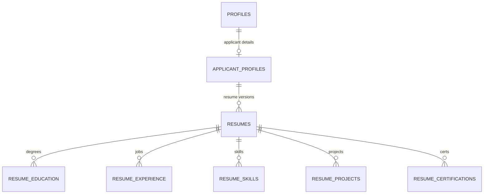

# Resume — Schema Design

Defines the `resumes` table and its structured content tables. KAN-50
explicitly deferred resume work (line 257: "Leave resume storage and parsing
to Brian's separate work"), so this doc owns the full resume domain.

## Relationship to KAN-50 tables

```
profiles              (KAN-50)  — auth identity
  └── applicant_profiles (KAN-50)  — stable contact info, links
        └── resumes                — file metadata, raw_text, parsed_json blob
              └── resume_education        — schools, degrees
              └── resume_experience       — jobs held
              └── resume_skills           — skill tags
              └── resume_projects         — personal/academic projects
              └── resume_certifications   — certs and licenses
```

`resumes` hangs off `applicant_profiles`, not `profiles`, so the DB enforces
that only applicants can own resumes. The applicant profile must exist before
the first upload — correct onboarding order (contact info first, then resume).

## Upload → parse → verify flow

1. User uploads a file (PDF, DOCX, etc.) → stored at `resumes.storage_path`.
2. Parser extracts text → `resumes.raw_text`, structured output → `resumes.parsed_json`, status → `parsed`.
3. Parsed data is written into the content tables below as a draft.
4. User reviews and edits the pre-filled entries in the UI.

## Re-upload behavior

Each upload creates a **new `resumes` row**. Old resumes and their content
tables are kept. `resumes.is_default` marks which resume is the applicant's
active one (enforced by a partial unique index — one default per applicant).
The applicant can switch their default or delete old versions.

## Authorization

SQLAlchemy connects as a privileged role, so Postgres RLS policies do not
fire. Authorization lives in FastAPI — endpoints verify that the authenticated
user owns the `applicant_profiles` row before allowing resume operations.
No RLS policies are defined for these tables.

## Diagram



## Enums

```sql
CREATE TYPE resume_status AS ENUM ('uploaded', 'parsed', 'parse_failed');
```

## Tables

### resumes

One row per uploaded resume file or pasted resume snapshot.

| Column | Type | Notes |
| --- | --- | --- |
| `id` | `uuid` | PK, default `gen_random_uuid()`. |
| `applicant_id` | `uuid` | FK → `applicant_profiles.profile_id`, `ON DELETE CASCADE`. |
| `original_filename` | `text` | Optional for pasted text. |
| `storage_path` | `text` | Supabase Storage path for uploaded files. Optional. |
| `file_hash` | `text` | SHA-256 hash of the uploaded file. Optional. |
| `status` | `resume_status` | Default `uploaded`. |
| `raw_text` | `text` | Extracted or pasted resume text. |
| `parsed_json` | `jsonb` | Raw parser output — not user-verified. |
| `is_default` | `boolean` | Default false. One default per applicant. |
| `created_at` | `timestamptz` | Default now. |
| `updated_at` | `timestamptz` | Default now. |

```sql
CREATE TABLE resumes (
    id                uuid PRIMARY KEY DEFAULT gen_random_uuid(),
    applicant_id      uuid NOT NULL REFERENCES applicant_profiles (profile_id) ON DELETE CASCADE,
    original_filename text,
    storage_path      text,
    file_hash         text,
    status            resume_status NOT NULL DEFAULT 'uploaded',
    raw_text          text,
    parsed_json       jsonb,
    is_default        boolean NOT NULL DEFAULT false,
    created_at        timestamptz NOT NULL DEFAULT now(),
    updated_at        timestamptz NOT NULL DEFAULT now()
);
CREATE INDEX resumes_applicant_idx ON resumes (applicant_id);

-- Only one default resume per applicant.
CREATE UNIQUE INDEX one_default_resume_per_applicant
  ON resumes (applicant_id)
  WHERE is_default = true;

-- No duplicate files per applicant.
CREATE UNIQUE INDEX unique_file_hash_per_applicant
  ON resumes (applicant_id, file_hash)
  WHERE file_hash IS NOT NULL;
```

### resume_education

| Column | Type | Notes |
| --- | --- | --- |
| `id` | `uuid` | PK, default `gen_random_uuid()`. |
| `resume_id` | `uuid` | FK → `resumes.id`, `ON DELETE CASCADE`. |
| `institution` | `text` | Required. School name. |
| `degree` | `text` | e.g. "Bachelor of Science". Optional — some entries are coursework or bootcamps. |
| `field_of_study` | `text` | e.g. "Computer Science". Optional. |
| `gpa` | `numeric(5,2)` | Optional. Supports 4.0, 5.0, 10.0, and 100-point scales. |
| `start_date` | `date` | Optional. |
| `end_date` | `date` | Optional. NULL = ongoing. |
| `description` | `text` | Optional. Honors, relevant coursework, activities. |
| `created_at` | `timestamptz` | Default now. |
| `updated_at` | `timestamptz` | Default now. |

Ordering: by `end_date DESC NULLS FIRST` (ongoing first, then newest).

```sql
CREATE TABLE resume_education (
    id             uuid PRIMARY KEY DEFAULT gen_random_uuid(),
    resume_id      uuid NOT NULL REFERENCES resumes (id) ON DELETE CASCADE,
    institution    text NOT NULL,
    degree         text,
    field_of_study text,
    gpa            numeric(5,2),
    start_date     date,
    end_date       date,
    description    text,
    created_at     timestamptz NOT NULL DEFAULT now(),
    updated_at     timestamptz NOT NULL DEFAULT now()
);
CREATE INDEX resume_education_resume_idx ON resume_education (resume_id);
```

### resume_experience

| Column | Type | Notes |
| --- | --- | --- |
| `id` | `uuid` | PK. |
| `resume_id` | `uuid` | FK → `resumes.id`, `ON DELETE CASCADE`. |
| `company_name` | `text` | Required. |
| `title` | `text` | Required. Job title held. |
| `location` | `text` | Optional. City/state or "Remote". |
| `start_date` | `date` | Optional. |
| `end_date` | `date` | Optional. NULL = current role. |
| `description` | `text` | Optional. Bullet points, achievements. |
| `created_at` | `timestamptz` | Default now. |
| `updated_at` | `timestamptz` | Default now. |

Ordering: by `end_date DESC NULLS FIRST` (current role first, then newest).

```sql
CREATE TABLE resume_experience (
    id            uuid PRIMARY KEY DEFAULT gen_random_uuid(),
    resume_id     uuid NOT NULL REFERENCES resumes (id) ON DELETE CASCADE,
    company_name  text NOT NULL,
    title         text NOT NULL,
    location      text,
    start_date    date,
    end_date      date,
    description   text,
    created_at    timestamptz NOT NULL DEFAULT now(),
    updated_at    timestamptz NOT NULL DEFAULT now()
);
CREATE INDEX resume_experience_resume_idx ON resume_experience (resume_id);
```

### resume_skills

| Column | Type | Notes |
| --- | --- | --- |
| `id` | `uuid` | PK. |
| `resume_id` | `uuid` | FK → `resumes.id`, `ON DELETE CASCADE`. |
| `skill_name` | `text` | Required. e.g. "Python", "Project Management". |
| `category` | `text` | Optional grouping. e.g. "Languages", "Frameworks", "Soft Skills". |

Constraint: unique `(resume_id, skill_name)` — no duplicate skills per resume.
Ordering: by `category` grouping, then alphabetical within each group.

```sql
CREATE TABLE resume_skills (
    id          uuid PRIMARY KEY DEFAULT gen_random_uuid(),
    resume_id   uuid NOT NULL REFERENCES resumes (id) ON DELETE CASCADE,
    skill_name  text NOT NULL,
    category    text,
    UNIQUE (resume_id, skill_name)
);
-- No separate resume_id index — the UNIQUE constraint already covers it.
```

### resume_projects

| Column | Type | Notes |
| --- | --- | --- |
| `id` | `uuid` | PK. |
| `resume_id` | `uuid` | FK → `resumes.id`, `ON DELETE CASCADE`. |
| `project_name` | `text` | Required. |
| `url` | `text` | Optional. GitHub link, live demo, etc. |
| `start_date` | `date` | Optional. |
| `end_date` | `date` | Optional. |
| `description` | `text` | Optional. What it does, tech used, your role. |
| `created_at` | `timestamptz` | Default now. |
| `updated_at` | `timestamptz` | Default now. |

Ordering: by `end_date DESC NULLS FIRST`, same as experience/education.

```sql
CREATE TABLE resume_projects (
    id            uuid PRIMARY KEY DEFAULT gen_random_uuid(),
    resume_id     uuid NOT NULL REFERENCES resumes (id) ON DELETE CASCADE,
    project_name  text NOT NULL,
    url           text,
    start_date    date,
    end_date      date,
    description   text,
    created_at    timestamptz NOT NULL DEFAULT now(),
    updated_at    timestamptz NOT NULL DEFAULT now()
);
CREATE INDEX resume_projects_resume_idx ON resume_projects (resume_id);
```

### resume_certifications

| Column | Type | Notes |
| --- | --- | --- |
| `id` | `uuid` | PK. |
| `resume_id` | `uuid` | FK → `resumes.id`, `ON DELETE CASCADE`. |
| `cert_name` | `text` | Required. e.g. "AWS Solutions Architect". |
| `issuer` | `text` | Optional. e.g. "Amazon Web Services". |

```sql
CREATE TABLE resume_certifications (
    id         uuid PRIMARY KEY DEFAULT gen_random_uuid(),
    resume_id  uuid NOT NULL REFERENCES resumes (id) ON DELETE CASCADE,
    cert_name  text NOT NULL,
    issuer     text
);
CREATE INDEX resume_certifications_resume_idx ON resume_certifications (resume_id);
```

## What was skipped

- **Proficiency level on skills** (beginner/intermediate/expert). Rarely
  trustworthy on resumes; add when matching/scoring needs it.
- **Awards / honors / publications / languages** — separate tables. Add when
  a UI section exists for them. Until then, they fit in
  `resume_education.description` or `resume_experience.description`.
- **Embeddings / vector columns** for AI matching. Belongs to a future
  matching/ATS ticket, not the base schema.
- **`resume_summary`** field. Already covered by `applicant_profiles.headline`
  and `resumes.raw_text`. Add if the UI needs an editable summary per resume.

## Notes for implementers

- `resume_skills` and `resume_certifications` intentionally have no
  `created_at`/`updated_at` — they are simple tags, not edited documents.
  The other three tables track timestamps for audit/display purposes.
- GPA uses `numeric(5,2)` to support international grading scales (up to
  999.99). Validate reasonable ranges in the FastAPI endpoint, not the DB.
- Alembic owns migrations. This doc is design rationale — do not apply SQL
  from here directly to Supabase.

## Implementation order

1. `resumes` — the parent table; everything else depends on it.
2. `resume_experience` — most universal resume section.
3. `resume_education` — second most common.
4. `resume_skills` — needed for matching and display.
5. `resume_projects` — common for students/early career.
6. `resume_certifications` — less common, lower priority.
