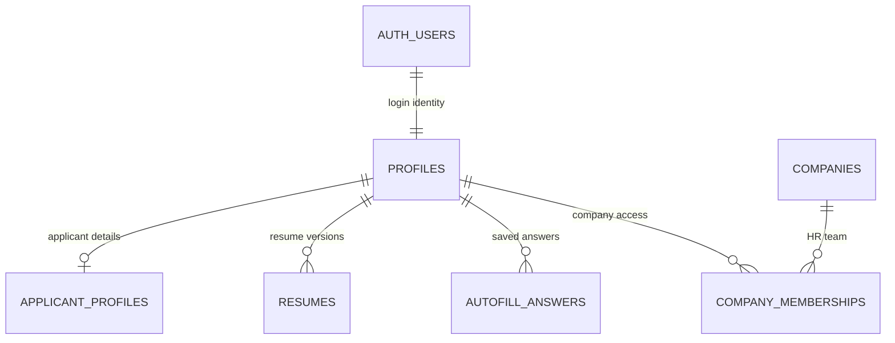

# KAN-50 Schema Structure

## Scope

Design the first domain schema for login-linked users, companies, HR membership,
and applicant profiles.

This is related to KAN-22, but does not implement authentication flows. KAN-22
owns sign-in, sign-out, route guards, and authorization helpers. KAN-50 owns the
tables those flows depend on.

## Intuitive Diagram



Read it as two joined halves:
- Applicant side: a signed-in user owns applicant details, resume versions, and reusable autofill answers.
- Business side: a company grants access to individual HR users through memberships.
- Shared identity: `profiles` is the only app-owned row tied directly to Supabase `auth.users`.

## Argument For Each Piece

| Piece | Why it is here | Similar solution signal |
| --- | --- | --- |
| `profiles` | Gives every Supabase auth user an app profile without putting product data in `auth.users`. | Supabase-style apps usually pair auth users with app-owned profile rows and RLS. |
| `applicant_profiles` | Stores stable applicant contact/profile data once, so resume parsing is helpful but not required for every form. | Autofill tools repeatedly fill name, phone, links, and location from a saved profile. |
| `resumes` | Supports multiple versions, original file storage, duplicate detection, parsed text, and structured JSON. | Simplify helper, AutoApply-style tools, and AI matching agents all separate resumes from applications/profile data. |
| `autofill_answers` | Captures repeated Workday-style questions such as sponsorship, authorization, availability, and salary expectations. | ApplyPilot and AutoApply-style projects use reusable answer banks. |
| `companies` | Creates one employer identity that future jobs, HR users, and public company pages can attach to. | SimplifyJobs normalizes company names/URLs on postings; ATS systems organize jobs under employers/orgs. |
| `company_memberships` | Allows many HR users per company with different permissions; avoids a brittle single-owner company model. | Workday/ATS-style tools are organization-scoped and permissioned by recruiting roles. |

## Tables

### profiles

One row per authenticated person.

| Column | Type | Notes |
| --- | --- | --- |
| `id` | `uuid` | Primary key. References `auth.users.id` with cascade delete. |
| `role` | enum | `applicant`, `hr`, or `admin`. Starts simple; company-specific HR permissions live in memberships. |
| `email` | `text` | Required. Copy from auth user for app queries and display. |
| `full_name` | `text` | Required for app identity. |
| `avatar_url` | `text` | Optional. |
| `created_at` | `timestamp` | Default now. |
| `updated_at` | `timestamp` | Updated by app or trigger. |

RLS:
- Users can read and update their own profile.
- Admin/service code can read all profiles through server-only admin paths.

### applicant_profiles

Applicant-only profile details for autofill and job applications.

| Column | Type | Notes |
| --- | --- | --- |
| `profile_id` | `uuid` | Primary key. References `profiles.id`. |
| `headline` | `text` | Optional short title. |
| `location` | `text` | Optional. |
| `phone` | `text` | Optional. |
| `linkedin_url` | `text` | Optional. |
| `github_url` | `text` | Optional. |
| `portfolio_url` | `text` | Optional. |
| `created_at` | `timestamp` | Default now. |
| `updated_at` | `timestamp` | Updated by app or trigger. |

RLS:
- Applicant can read/update only their own applicant profile.
- HR users do not read this directly unless tied to an application they can access.

### resumes

One row per uploaded resume file or pasted resume snapshot. Keep resumes outside
`applicant_profiles` so a user can have multiple versions and applications can
later reference the exact resume used.

| Column | Type | Notes |
| --- | --- | --- |
| `id` | `uuid` | Primary key. |
| `profile_id` | `uuid` | References `profiles.id`. |
| `original_filename` | `text` | Optional for pasted text. |
| `storage_path` | `text` | Optional Supabase Storage path for uploaded files. |
| `file_hash` | `text` | Optional SHA-256 hash. Unique per profile when present. |
| `status` | enum | `uploaded`, `parsed`, `parse_failed`. |
| `raw_text` | `text` | Extracted or pasted resume text. |
| `parsed_json` | `jsonb` | Structured resume fields for autofill and ATS review. |
| `is_default` | `boolean` | Default false. One default resume per profile should be enforced in app code for MVP. |
| `created_at` | `timestamp` | Default now. |
| `updated_at` | `timestamp` | Updated by app or trigger. |

RLS:
- Applicant can read/write only their own resumes.
- HR users can access a submitted resume later through an application-scoped table,
  not directly through this table.

### autofill_answers

Reusable answers for common application questions.

| Column | Type | Notes |
| --- | --- | --- |
| `id` | `uuid` | Primary key. |
| `profile_id` | `uuid` | References `profiles.id`. |
| `question_key` | `text` | Stable key such as `work_authorization`, `sponsorship`, `start_date`. |
| `question_text` | `text` | Human-readable prompt or last seen wording. |
| `answer` | `text` | User-approved answer. |
| `created_at` | `timestamp` | Default now. |
| `updated_at` | `timestamp` | Updated by app or trigger. |

Constraints:
- Unique `(profile_id, question_key)`.

RLS:
- Applicant can read/write only their own answers.

### companies

One row per employer/company account.

| Column | Type | Notes |
| --- | --- | --- |
| `id` | `uuid` | Primary key. |
| `name` | `text` | Required. |
| `slug` | `text` | Unique, used in URLs if needed. |
| `website_url` | `text` | Optional. |
| `contact_email` | `text` | Optional company contact email for applicants or admin follow-up. |
| `contact_phone` | `text` | Optional company contact phone number. |
| `logo_url` | `text` | Optional. |
| `description` | `text` | Optional. |
| `industry` | `text` | Optional. |
| `size_range` | `text` | Optional, e.g. `1-10`, `11-50`, `51-200`. |
| `created_at` | `timestamp` | Default now. |
| `updated_at` | `timestamp` | Updated by app or trigger. |

RLS:
- Public/seeker reads should eventually see published company profile fields.
- Company HR members can update their company based on membership role.

### company_memberships

Connects individual HR users to companies.

| Column | Type | Notes |
| --- | --- | --- |
| `id` | `uuid` | Primary key. |
| `company_id` | `uuid` | References `companies.id`. |
| `profile_id` | `uuid` | References `profiles.id`. |
| `role` | enum | `owner`, `admin`, `recruiter`, `reviewer`. |
| `status` | enum | `active`, `invited`, `disabled`. |
| `created_at` | `timestamp` | Default now. |
| `updated_at` | `timestamp` | Updated by app or trigger. |

Constraints:
- Unique `(company_id, profile_id)`.
- Only active memberships grant company access.

RLS:
- HR can read their own memberships.
- Active company admins/owners can manage memberships for their company.
- Recruiters/reviewers can read company-scoped data but not manage membership.

## Argument For Key Columns

| Column group | Columns | Why we need them |
| --- | --- | --- |
| Identity | `id`, `profile_id`, `company_id` | Stable UUID joins that map cleanly to Supabase Auth, RLS policies, and future foreign keys. |
| Access | `role`, `company_memberships.role`, `status` | Separates a user's default app mode from real company permissions. Disabled/invited users do not get access. |
| Display/contact | `email`, `full_name`, `avatar_url`, `phone`, links, `location` | Lets the UI and autofiller work without reparsing a resume on every page load. |
| Resume durability | `original_filename`, `storage_path`, `file_hash`, `raw_text`, `parsed_json`, `status` | Keeps the original file, extracted text, parse result, and parse state independently recoverable. |
| Autofill reuse | `question_key`, `question_text`, `answer` | `question_key` dedupes known questions; `question_text` preserves wording when a portal asks it differently. |
| Company basics | `name`, `slug`, `website_url`, `contact_email`, `contact_phone`, `logo_url`, `description`, `industry`, `size_range` | Enough public employer data for dashboards and future job pages without modeling jobs yet. |
| Auditability | `created_at`, `updated_at` | Required for sorting, sync, debugging, and future admin review. |

## Enums

```text
user_role: applicant, hr, admin
company_member_role: owner, admin, recruiter, reviewer
membership_status: active, invited, disabled
resume_status: uploaded, parsed, parse_failed
```

## Relationships

```text
auth.users
  1 -> 1 profiles

profiles
  1 -> 0/1 applicant_profiles
  1 -> many resumes
  1 -> many autofill_answers
  1 -> many company_memberships

companies
  1 -> many company_memberships
```

## KAN-22 Boundary

KAN-50 should provide:
- `profiles`
- `companies`
- `company_memberships`
- `applicant_profiles`
- `resumes`
- `autofill_answers`
- RLS policies that enforce ownership and company membership

KAN-22 should provide:
- Supabase auth UI/actions
- session refresh middleware
- applicant/company route guards
- helpers like `requireUser()`, `requireApplicant()`, and `requireCompanyMember(companyId)`

## First Implementation Order

1. Add enums.
2. Add `profiles`.
3. Add `companies`.
4. Add `company_memberships`.
5. Add `applicant_profiles`.
6. Add `resumes`.
7. Add `autofill_answers`.
8. Add minimal RLS policies.
9. Generate and review Drizzle migration SQL.

## Cross-Reference With Similar Projects

These are not perfect clones of JobWrite, Simplify, or Workday, but they are
close enough to sanity-check the schema against public code and docs.

| Reference | Relevant schema/product pattern | What it means for KAN-50 |
| --- | --- | --- |
| [SimplifyJobs internship list](https://github.com/SimplifyJobs/Summer2027-Internships) | Stores normalized listing fields: company, title, locations, URL, active flag, source, posted/updated timestamps. | KAN-50 does not need jobs yet, but future `jobs` should keep source URL/status metadata separate from user applications. |
| [Simplify Internship Helper](https://github.com/aaryan-rampal/Simplify-Internship-Helper) | Adds per-user application tracking on top of listings: applied flag, resume FK, applied date, notes, plus a separate resumes table with file hash and path. | Move resume data out of `applicant_profiles`; use a `resumes` table and later reference a resume from each application. |
| [AutoApply](https://github.com/unnati396/auto-apply) | Centers autofill around parsed resume data, an answer bank, application tracker, match score, tailored resume filename, and generated cover letter. | Add `autofill_answers` now. Leave match scores, tailored docs, and application history for later ATS/autofill tickets. |
| [ApplyAI](https://github.com/muhammad-saadd/applyai) | Uses a browser pipeline: detect portal, extract job/form, build prompts, generate answers, fill fields. Supports Workday/Greenhouse/Lever/Ashby/SmartRecruiters. | Keep browser automation/session state out of KAN-50. Store only durable profile, resume, and answer data here. |
| [ApplyPilot](https://github.com/iknalos/ApplyPilot) | Stores a profile once, maps repeated job-application questions, uses APIs where possible, and falls back to browser automation for Workday-like portals. | `autofill_answers` should be user-approved and reusable; final submission should stay user-controlled in later autofill work. |
| [AI Job Application Agent](https://github.com/simrangarg482-bot/AI-Job-Application-Agent) | Uses separate `resumes`, `jobs`, and `match_results`; resumes keep raw text, parsed JSON, confidence/status, and embeddings. | Store raw and parsed resume data durably. Do not add embeddings/match tables in KAN-50 unless ATS matching is in scope. |
| [EmpRecruit / Workday-like ATS clone](https://github.com/EmpCloud/emp-recruit) | Uses full ATS tables: jobs, candidates, applications, stage history, interviews, feedback, offers, resume scores, pipeline stage configs, career page config. | KAN-50 is only the identity/company foundation. Jobs, applications, stages, interview/OA, and resume scores should be separate tickets. |
| [Workday Recruiting docs](https://doc.workday.com/admin-guide/en-us/human-capital-management/recruiting/recruiting-setup/san1412355600558.html) | Recruiting is modeled as job applications moving through review, screen, interview, assessment, offer, and background-check stages. | Do not overload KAN-50 with ATS workflow tables. Add those in the ATS epic after identity/company membership exists. |
| [Resume Optimizer AI](https://github.com/lokeshpara/Resume-Optimizer-AI) | Tracks applications, notes, contacts, optimization checkpoints, bot sessions, and ATS-specific handlers for Workday/Greenhouse/Lever. | Do not bake browser automation state into profile tables. If autofill needs sessions later, create a separate `autofill_runs` table. |

## Resulting Adjustments

- Keep `profiles`, `companies`, and `company_memberships`.
- Add `resumes` because every serious autofill/ATS-like clone separates resume
  files, parsed text, and parsed structure from the base applicant profile.
- Add `autofill_answers` because Workday-style forms repeatedly ask the same
  authorization, sponsorship, availability, and demographic questions.
- Do not add jobs, applications, pipeline stages, interviews, offers, or AI
  scores to KAN-50. Those show up in ATS clones, but they belong to later job
  board, applications, and ATS review tickets.

## Open Questions

- Should one user be both an applicant and an HR member? Recommended: yes.
- Should company creation be self-serve or admin-approved? Recommended: self-serve for MVP.
- Should resume text live in Postgres or object storage metadata? Recommended: Postgres for extracted text and parsed JSON; Supabase Storage for original files.
- Should `role` on `profiles` exist if memberships already model HR access? Recommended: make it a UI default, not an authorization source. Real HR access comes from `company_memberships`.
