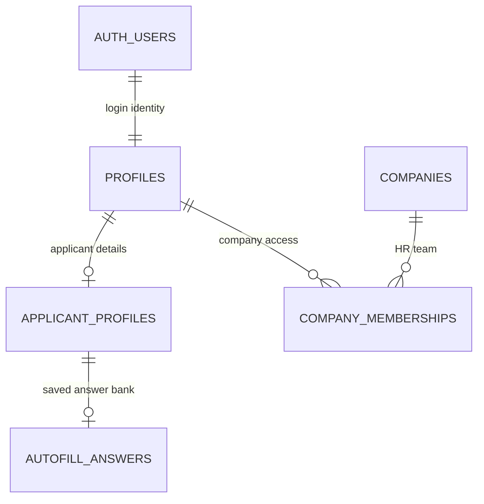

# KAN-50 Schema Structure

## Scope

Design the first domain schema for login-linked users, companies, HR membership,
and applicant profiles.

This is related to KAN-22, but does not implement authentication flows. KAN-22
owns sign-in, sign-out, route guards, and authorization helpers. KAN-50 owns the
tables those flows depend on.

## Intuitive Diagram



Read it as two joined halves:
- Applicant side: a signed-in user may own applicant details and a reusable autofill answer bank.
- Business side: a company grants access to individual HR users through memberships.
- Shared identity: `profiles` is the only app-owned row tied directly to Supabase `auth.users`.
- A user may have both an applicant profile and active company memberships.

## Argument For Each Piece

| Piece | Why it is here | Similar solution signal |
| --- | --- | --- |
| `profiles` | Gives every Supabase auth user an app profile without putting product data in `auth.users`. | Supabase-style apps usually pair auth users with app-owned profile rows and RLS. |
| `applicant_profiles` | Stores applicant-specific data without forcing a global user role. | Autofill tools repeatedly fill links and location from a saved applicant profile. |
| `autofill_answers` | Captures repeated Workday-style questions such as sponsorship, authorization, availability, and salary expectations. | ApplyPilot and AutoApply-style projects use reusable answer banks. |
| `companies` | Creates one employer identity that future jobs, HR users, and public company pages can attach to. | SimplifyJobs normalizes company names/URLs on postings; ATS systems organize jobs under employers/orgs. |
| `company_memberships` | Allows many HR users per company with different permissions; avoids a brittle single-owner company model. | Workday/ATS-style tools are organization-scoped and permissioned by recruiting roles. |

## Tables

### profiles

One row per authenticated person.

| Column | Type | Notes |
| --- | --- | --- |
| `id` | `uuid` | Primary key. References `auth.users.id` with `ON DELETE CASCADE`. |
| `email` | `text` | Required. Copy from auth user for app queries and display. |
| `full_name` | `text` | Required for app identity. |
| `phone_number` | `text` | Optional shared contact number for applicants and HR users. |
| `avatar_url` | `text` | Optional. |
| `created_at` | `timestamptz` | Default now. |
| `updated_at` | `timestamptz` | Updated by app or trigger. |

RLS:
- Users can read and update their own profile.
- Server-only service-role code can read all profiles.

### applicant_profiles

Applicant-only profile details for autofill and job applications.

| Column | Type | Notes |
| --- | --- | --- |
| `profile_id` | `uuid` | Primary key. References `profiles.id` with `ON DELETE CASCADE`. |
| `headline` | `text` | Optional short title. |
| `location` | `text` | Optional. |
| `linkedin_url` | `text` | Optional. |
| `github_url` | `text` | Optional. |
| `portfolio_url` | `text` | Optional. |
| `created_at` | `timestamptz` | Default now. |
| `updated_at` | `timestamptz` | Updated by app or trigger. |

RLS:
- Applicant can read/update only their own applicant profile.
- HR users do not read this directly unless tied to an application they can access.

### autofill_answers

One reusable answer bank per applicant. Keys are stable question identifiers,
and each value stores the last recognized wording and the user-approved answer.

```json
{
  "work_authorization": {
    "question_text": "Are you authorized to work in the United States?",
    "answer": "Yes"
  }
}
```

| Column | Type | Notes |
| --- | --- | --- |
| `applicant_id` | `uuid` | Primary key. References `applicant_profiles.profile_id` with `ON DELETE CASCADE`. |
| `answers` | `jsonb` | `NOT NULL DEFAULT '{}'::jsonb`. Maps stable question keys to `question_text` and `answer`. |
| `created_at` | `timestamptz` | Default now. |
| `updated_at` | `timestamptz` | Updated by app or trigger. |

RLS:
- Applicant can read/write only their own answers.

### companies

One row per employer/company account.

| Column | Type | Notes |
| --- | --- | --- |
| `id` | `uuid` | Primary key. |
| `name` | `text` | Required. |
| `slug` | `text` | Unique, used in URLs if needed. |
| `website_url` | `text` | Optional. |
| `contact_email` | `text` | Optional company contact email for applicants or admin follow-up. |
| `contact_phone` | `text` | Optional company contact phone number. |
| `logo_url` | `text` | Optional. |
| `description` | `text` | Optional. |
| `industry` | `text` | Optional. |
| `size_range` | enum | Optional `company_size_range` value for consistent job-board filtering. |
| `created_at` | `timestamptz` | Default now. |
| `updated_at` | `timestamptz` | Updated by app or trigger. |

RLS:
- Public/seeker reads should eventually see published company profile fields.
- Active members can read their company; only active owners can update company information.

### company_memberships

Connects individual HR users to companies.

| Column | Type | Notes |
| --- | --- | --- |
| `id` | `uuid` | Primary key. |
| `company_id` | `uuid` | References `companies.id` with `ON DELETE CASCADE`. |
| `profile_id` | `uuid` | References `profiles.id` with `ON DELETE CASCADE`. |
| `role` | enum | `owner`, `admin`, or `recruiter`. |
| `status` | enum | `active`, `invited`, `disabled`. |
| `created_at` | `timestamptz` | Default now. |
| `updated_at` | `timestamptz` | Updated by app or trigger. |

Constraints:
- Unique `(company_id, profile_id)`.
- Only active memberships grant company access.

RLS:
- Users can read their own memberships.
- Active owners can update company information and manage memberships.
- Active admins can manage recruiter memberships but cannot update company information.
- Active recruiters can read company-scoped recruiting data but cannot manage memberships.
- Ownership comes only from active `owner` memberships; `companies.owner_id` is intentionally omitted.

## Argument For Key Columns

| Column group | Columns | Why we need them |
| --- | --- | --- |
| Identity | `id`, `profile_id`, `company_id` | Stable UUID joins that map cleanly to Supabase Auth, RLS policies, and future foreign keys. |
| Access | `company_memberships.role`, `status` | Company access comes from active memberships, while applicant access comes from an applicant profile. |
| Display/contact | `email`, `full_name`, `phone_number`, `avatar_url`, links, `location` | Lets the UI and autofiller use shared contact data without duplicating it by user type. |
| Autofill reuse | `applicant_id`, `answers` | One JSONB answer bank handles portal-specific wording without adding one row per question. |
| Company basics | `name`, `slug`, `website_url`, `contact_email`, `contact_phone`, `logo_url`, `description`, `industry`, `size_range` | Enough public employer data for dashboards and future job pages without modeling jobs yet. |
| Auditability | `created_at`, `updated_at` | Required for sorting, sync, debugging, and future admin review. |

## Enums

```text
company_member_role: owner, admin, recruiter
membership_status: active, invited, disabled
company_size_range: 1-10, 11-50, 51-200, 201-500, 501-1000, 1001-5000, 5001-10000, 10001+
```

## Relationships

```text
auth.users
  1 -> 1 profiles

profiles
  1 -> 0/1 applicant_profiles
  1 -> many company_memberships

applicant_profiles
  1 -> 0/1 autofill_answers

companies
  1 -> many company_memberships
```

## KAN-22 Boundary

KAN-50 should provide:
- `profiles`
- `companies`
- `company_memberships`
- `applicant_profiles`
- `autofill_answers`
- RLS policies that enforce ownership and company membership

KAN-22 should provide:
- Supabase auth UI/actions
- session refresh middleware
- applicant/company route guards
- helpers like `requireUser()`, `requireApplicant()`, and `requireCompanyMember(companyId)`

## First Implementation Order

1. Add enums.
2. Add `profiles`.
3. Add `companies`.
4. Add `company_memberships`.
5. Add `applicant_profiles`.
6. Add `autofill_answers`.
7. Add minimal RLS policies.
8. Generate and review Drizzle migration SQL.

## Cross-Reference With Similar Projects

These are not perfect clones of JobWrite, Simplify, or Workday, but they are
close enough to sanity-check the schema against public code and docs.

| Reference | Relevant schema/product pattern | What it means for KAN-50 |
| --- | --- | --- |
| [SimplifyJobs internship list](https://github.com/SimplifyJobs/Summer2027-Internships) | Stores normalized listing fields: company, title, locations, URL, active flag, source, posted/updated timestamps. | KAN-50 does not need jobs yet, but future `jobs` should keep source URL/status metadata separate from user applications. |
| [AutoApply](https://github.com/unnati396/auto-apply) | Centers autofill around parsed resume data, an answer bank, application tracker, match score, tailored resume filename, and generated cover letter. | Add `autofill_answers` now. Leave match scores, tailored docs, and application history for later ATS/autofill tickets. |
| [ApplyAI](https://github.com/muhammad-saadd/applyai) | Uses a browser pipeline: detect portal, extract job/form, build prompts, generate answers, fill fields. Supports Workday/Greenhouse/Lever/Ashby/SmartRecruiters. | Keep browser automation/session state out of KAN-50. Store only durable profile and answer data here. |
| [ApplyPilot](https://github.com/iknalos/ApplyPilot) | Stores a profile once, maps repeated job-application questions, uses APIs where possible, and falls back to browser automation for Workday-like portals. | `autofill_answers` should be user-approved and reusable; final submission should stay user-controlled in later autofill work. |
| [EmpRecruit / Workday-like ATS clone](https://github.com/EmpCloud/emp-recruit) | Uses full ATS tables: jobs, candidates, applications, stage history, interviews, feedback, offers, resume scores, pipeline stage configs, career page config. | KAN-50 is only the identity/company foundation. Jobs, applications, stages, interview/OA, and resume scores should be separate tickets. |
| [Workday Recruiting docs](https://doc.workday.com/admin-guide/en-us/human-capital-management/recruiting/recruiting-setup/san1412355600558.html) | Recruiting is modeled as job applications moving through review, screen, interview, assessment, offer, and background-check stages. | Do not overload KAN-50 with ATS workflow tables. Add those in the ATS epic after identity/company membership exists. |
| [Resume Optimizer AI](https://github.com/lokeshpara/Resume-Optimizer-AI) | Tracks applications, notes, contacts, optimization checkpoints, bot sessions, and ATS-specific handlers for Workday/Greenhouse/Lever. | Do not bake browser automation state into profile tables. If autofill needs sessions later, create a separate `autofill_runs` table. |

## Resulting Adjustments

- Keep `profiles`, `companies`, and `company_memberships`.
- Add `autofill_answers` because Workday-style forms repeatedly ask the same
  authorization, sponsorship, availability, and demographic questions.
- Leave resume storage and parsing to Brian's separate work.
- Do not add jobs, applications, pipeline stages, interviews, offers, or AI
  scores to KAN-50. Those show up in ATS clones, but they belong to later job
  board, applications, and ATS review tickets.

## Decisions

- A user can be both an applicant and an HR member. No global user role is needed.
- Active company memberships are the authorization source for HR access.
- Active owner memberships are the ownership source; companies do not duplicate an `owner_id`.
- Deleting a user cascades through user-owned rows and memberships, but never deletes a company.
- Deleting a company cascades through its memberships, but never deletes user profiles.
- Company creation is self-serve for MVP.
- Resume storage and parsing are outside KAN-50 and owned by Brian's separate work.
