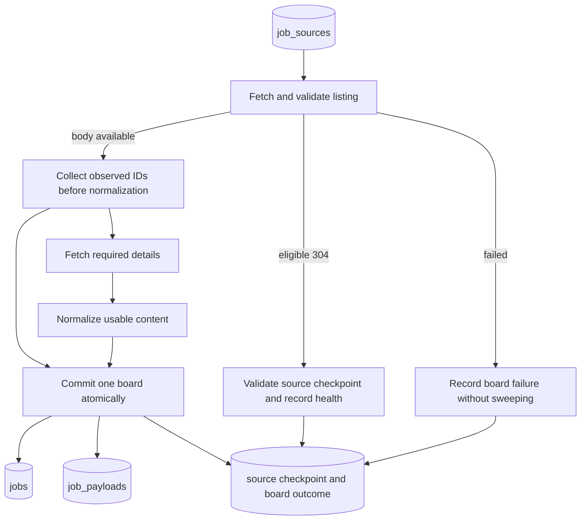

# KAN-55 Job Scraper Architecture

## 1. Scope and implementation status

Build WorkIt's job ingestion engine: a registry of employer ATS boards,
provider adapters, normalized postings, and an open/closed lifecycle in
Supabase Postgres.

**This is an implementation specification.** This branch contains only this
architecture document for review. Backend packaging, CLI, adapters, ingestion
tables, migrations, tests, and npm scraper commands are implementation work
and are not included in these commits.

Adapt the Python ingestion core from zshah101's internship engine and selected
provider mappings from ats-scrapers. Keep HTTPX and add Psycopg when persistence
lands. Use their relevant modules and tests rather than copying their entire
applications. The [research appendix](#9-research-appendix) pins the
reviewed revisions, distinguishes measurements from recommendations, and maps
each adaptation to source code.

### Boundaries

- Initial providers: Greenhouse, Lever, Ashby, SmartRecruiters.
- Drizzle in `frontend/` owns schema definitions and migrations. Python only
  reads and writes data; it does not create tables, including staging tables.
- Postgres is authoritative. There is no committed JSON mirror or publishing
  workflow. Real scraped postings and captured responses never enter Git.
- Ingest all publicly listed roles from enabled sources. Region, role, age,
  and per-company display limits belong to downstream selection, not the
  evidence used to detect source removal.
- UI integration, matching, resume parsing, employer job creation, claim
  verification, cross-source fuzzy deduplication, additional ATSes, and
  scheduler deployment remain separate work.
- Removal from a feed is evidence of delisting. Presence in a feed does not
  prove that an employer is actively hiring or that a vacancy is genuine.

### Company-schema dependency

KAN-50 defines `companies` and `company_memberships`; its design document is
on the `KAN-50-login-business-profiles` branch, not in this checkout. The
current Drizzle schema barrel is empty. Merge the implemented KAN-50 schema
before generating ingestion migrations with company foreign keys or membership
policies. Do not implement a second company schema in Python.

Until explicitly mapped, a source and its jobs retain a nullable `company_id`
and their source display name. Discovery never grants memberships, merges
companies by name, or marks them claimed. Creation of unclaimed company
profiles and claim verification belong to the company-domain work; this ticket
does not promise those rows.

## 2. Pipeline and contracts

Separate **observation** (which IDs the source returned), **content** (what was
successfully normalized), and **lifecycle** (whether a row should close or
reopen). A description failure is not a missing posting. An unchanged content
hash does not mean that lifecycle work can be skipped.

Discovery is a separate command. Polling consumes the enabled registry; it does
not rediscover or probe every seed on each run.

### Adapter result

Every adapter returns a `FetchResult` with the following information. A
`not_modified` result is not an empty `complete` result.

| Field | Contract |
| --- | --- |
| `source_id`, `expected_state_version` | Board and committed source-state version read before fetching. |
| `observation_id`, `observed_at` | Unique attempt ID and UTC fetch-start time. Retries retain the attempt ID. |
| `outcome` | `complete`, `partial`, `not_modified`, or `failed`. |
| `observed_ids` | Every valid external ID in the listing, before content rejection or visibility filtering. |
| `jobs` | Successfully normalized records, keyed by external ID. |
| `payloads` | Listing items and successful detail payloads required for replay. |
| `detail_failures` | IDs whose required detail fetch failed, with bounded error metadata. |
| `incomplete_reason` | `malformed_response`, `invalid_identity`, `pagination_stalled`, `inconsistent_total`, `request_failed`, or `safety_limit`; null for complete listings. |
| `request_key`, `candidate_etag` | Canonical method, host, path, representation-affecting query parameters/headers, and validator for that exact request. |
| Counts | Reported total where available, returned rows, distinct observed IDs, rejected rows, pages, requests, and bytes. |

Completeness describes listing enumeration, independently of description
availability. Validate the provider's envelope first: Lever returns an array;
the other three use object envelopes. Truthy error indicators invalidate an
object envelope, while `error: null` alone does not. Require object list
members and usable external IDs. Unknown optional fields become null; rejected
content with a valid ID still supplies positive presence evidence.

Malformed containers, unidentifiable members, or conflicting duplicates make
the result partial. Preserve usable rows and observed IDs, but do not use
omissions from that result to close jobs. A network failure after some pages
likewise produces a partial result; failure before any usable listing data
produces a failed result.

### Normalized posting

Use one dataclass shared by adapters and persistence. Require a non-blank
external ID, title, source display name, and HTTP(S) application/posting URL.
Do not generate random identities for rejected records.

Preserve source fields alongside derived values:

- Content: `title`, `description_html`, `description_text`, `apply_url`.
- Location: `location_raw`, `locations` (all supplied locations),
  `country_iso`, nullable `workplace_type` and `is_remote`.
- Compensation: optional scalar min/max, currency, period, original text, and
  `compensation_ranges` retaining distinct tiers and components.
- Classification: optional employment type, department, team, level, and
  requisition ID.
- Timing: `source_published_at`, `source_updated_at`, `posted_at_source`
  (provider field/provenance), and `posted_at_precision`
  (`unknown`, `relative_derived`, `date_only`, `exact`).
- Visibility: `is_listed`, independent of presence and `active`.

Treat these types as the boundary between adapters and the store, not as a
second ORM schema. Drizzle remains the database schema owner.

## 3. Provider contracts

| Provider | Listing and identity | Content and structured fields | Refresh policy |
| --- | --- | --- | --- |
| Greenhouse | `GET https://boards-api.greenhouse.io/v1/boards/{token}/jobs`; object with `jobs`; validate `meta.total` when supplied; posting `id`. | Fetch `/jobs/{id}?pay_transparency=true` for descriptions and pay ranges. Preserve departments/offices supplied by the chosen response. Convert pay amounts from cents; do not guess a missing period. | Details for new IDs, changed upstream `updated_at`, pending details, and successful detail data older than 24 hours. |
| Lever | `GET https://api.lever.co/v0/postings/{slug}?mode=json`; top-level array; posting `id`. Preserve `api.eu.lever.co` for EU boards. | Title is `text`. Assemble description, lists, and additional sections. Map `salaryRange`, `workplaceType`, and all supplied locations. | Inline content on each body response. Do not invent a modification timestamp from `createdAt`. |
| Ashby | `GET https://api.ashbyhq.com/posting-api/job-board/{name}?includeCompensation=true`; object with `jobs`; posting `id`. | Inline HTML/text, primary/secondary locations, workplace type, compensation tiers. `isListed=false` means direct-link-only: retain observation but exclude from public reads. | Inline content on each body response. `publishedAt` means last publication, not necessarily first creation. |
| SmartRecruiters | `GET https://api.smartrecruiters.com/v1/companies/{id}/postings?limit=100&offset=...`; `content` envelope and `totalFound`; posting `id`. | `/postings/{id}` supplies `jobAd.sections` and application URL. Concatenate the description, qualifications, additional information, and company-description sections. | Details for new IDs, changed listing-item fingerprint, pending details, and successful detail data older than 24 hours. `releasedDate` is not a reliable modification cursor. |

These mappings use [official provider contracts and inspected adapter
code](#provider-contracts). The 24-hour refresh periods
are WorkIt defaults, not provider guarantees.

### Pagination and request identity

For SmartRecruiters, fetch all pages. Check the reported total, distinct
identities, and progress on every page. An empty/short page before the reported
total, changing totals, overlapping IDs, or a repeated page makes the result
partial. A normal complete result has exhausted the listing and collected the
reported number of distinct IDs. Treat a malformed total as incomplete rather
than assuming that an empty list proves a complete board.

There is no assumed 300-job provider cap. That value is a limit in the
reference internship scraper. Reaching a configured request, size, or runtime
safety limit returns partial evidence; it never means the board ended.
Offset pagination does not provide snapshot isolation, so even an internally
consistent traversal still needs the lifecycle confirmation rule below.

Registry identity is unique on `(ats, api_host, board_token)`. Use allowlisted
provider hosts and preserve provider-specific token case. The natural posting
key is `(source_id, external_id)`; a URL or a display name is not a substitute.
Two requisitions with the same title/location must remain separate.

## 4. Lifecycle, content updates, and caching

### Lifecycle transitions

Adapt the upstream [store and regression
tests](#adaptation-map), including reopening and
first-seen preservation.

| Evidence for a stored scraped job | Action |
| --- | --- |
| ID observed, including in a partial listing | Reset `missing_streak`, update `last_seen_at`, set `active=true`, and clear closure fields. Apply visibility separately when known. |
| ID absent from an accepted complete listing; sweeping enabled | Increment `missing_streak` once. At two, set `active=false`, `closed_at`, and `closed_reason=gone_from_feed`. |
| ID absent from partial/failed/skipped/not-modified result | Do not increment or reset the streak; there is no new negative evidence. |
| Explicit provider visibility changes | Update `is_listed`; do not classify the posting as gone from the feed. |
| Same observation is delivered twice or source version conflicts | Do not apply it again. |
| Sweeping disabled | Apply positive observations and content; do not increment missing streaks or close on absence. Reset pending streaks when disabling sweeping so re-enabling starts fresh confirmation. |

Two misses means two distinct accepted complete observations since the most
recent positive observation. Unknown results between them do not count.
Automatic confirmation happens on the next scheduled poll, not an immediate
HTTP retry in the same invocation. This reduces false closures; it does not
guarantee that an ATS never returns the same erroneous omission twice.

All upserts and sweeps operate within one source and `origin=scraped`.
Employer-authored rows are never eligible. Do not delete job rows as a scraping
retention policy; stable IDs must survive closure and future application links.
Already-closed absent jobs stay closed without increasing the streak or moving
`closed_at` on every poll. Pending confirmation means an active job at one miss;
closed rows do not keep conditional requests disabled indefinitely.

### Content updates are separate writes

`content_hash` covers normalized source content and visibility, excluding
polling timestamps, run IDs, missing streaks, and other lifecycle machinery.
When unchanged, skip content replacement only. Presence, reopening, replay
version, and provenance updates still run when required.

`content_updated_at` means the normalized content changed, including a
normalizer correction. It does not assert that the employer edited the role.
`source_updated_at` carries an actual upstream modification time where
available; `first_seen_at` is immutable and `last_seen_at` records a positive
listing observation.

Use field provenance as well as precision for publication dates. Do not turn
an upstream modification timestamp into a publication date. A newer response
may correct a same-precision authoritative source value, particularly a
republished Ashby posting. Unknown or lower-quality evidence must not overwrite
better known data.

### ETag eligibility

An ETag is an optimization for an exact representation, not a global
board-version guarantee. Start with Greenhouse, Lever, and Ashby whole-list
requests. SmartRecruiters listing requests remain unconditional in v1.

Send `If-None-Match` only when all of the following hold:

1. The validator belongs to the current request key and a complete listing
   whose state was committed successfully.
2. The previous accepted outcome is complete or an eligible revalidation.
3. The source has no pending missing-job confirmations, rejected content, or
   failed required details.
4. No detail refresh is due, and the last unconditional listing refresh was
   less than 24 hours ago.

A `304` updates source validation time and health under the same version
check used for body responses. It does not update job `last_seen_at`, advance
missing streaks, or conceal pending work. If preconditions fail, issue an
unconditional request. An unexpected `304` without a usable checkpoint is
retried without the validator; if no body is obtained, record failure.

Persist the candidate ETag only with its corresponding successful board
transaction. Partial results invalidate conditional eligibility; representation
changes clear the validator. If a complete listing has detail failures, its
validator may be stored, but pending-work state prevents skipping recovery.
Failed new records without a usable normalized row likewise block conditional
eligibility until a later successful body pass resolves them.
Disable conditional requests when response `Vary` requirements cannot be
represented safely by the request key, including `Vary: *`.

This avoids the failure sequence `200 missing → 304 → 304 …` leaving a job
permanently at one miss. It also avoids checkpointing a response whose database
write failed.

## 5. Persistence and replay

### Tables and access

| Table | Required information | Access |
| --- | --- | --- |
| `job_sources` | Registry key, display name, nullable company mapping, enabled and sweep-enabled flags, `state_version`, accepted observation ID/time/outcome, request key/ETag, last poll/validation/unconditional-refresh times, pending-work flag, consecutive failures, quarantine and next eligible poll time. | Service only. |
| `jobs` | Stable UUID, source/external key, origin, nullable company mapping, normalized fields from section 2, `active`, `is_listed`, closure fields, missing streak, observation timestamps, content hash/version/time, last source-run ID. | Public reads require `active AND is_listed`. Scraped rows are service-write-only. |
| `scrape_runs` | Invocation ID, start/finish, status, selected-source count, aggregate outcomes, requests, bytes, and duration. | Service only. |
| `scrape_source_runs` | Attempt/observation ID, run/source IDs, expected version, timing, outcome, counts, incompleteness/errors, `sweep_performed`, `sweep_skip_reason`, and new/updated/reopened/closed totals. Unique `(run_id, source_id)`. | Service only. |
| `job_payloads` | One row per scraped job; latest accepted listing item and successful detail payload, their fetch times, detail state (`pending`/`ready`/`not_required`), and normalization version. | Service only; never included in public job responses. |

Enforce unique `(source_id, external_id)` for scraped jobs. Scraped origin
requires both identities; employer origin requires a company and has null
source/external identities. Origin is not client-editable. Employer writes
require active membership in the owning company, with both existing-row and
new-row checks. Until those membership policies exist, deny employer writes.
Service-only tables have RLS enabled and no client policies. Preserve jobs
when disabling a source or removing a company mapping.

The two additional tables have concrete purposes: per-board outcomes remain
queryable even for an empty board, and full replay data is separated from the
public normalized posting.

Keep database credentials in a backend-only environment variable, never a
client-prefixed variable, fixture, or log. Use the project's Supabase direct
or session-pooler Postgres connection for this long-lived worker. If deployment
requires the transaction pooler instead, configure Psycopg without automatic
prepared statements and verify that mode in integration tests. Follow the
[Supabase connection guidance](https://supabase.com/docs/guides/database/connecting-to-postgres)
for the deployed network and pooler mode; do not reuse a browser client key as
a database password.

### One transaction per board

Create the invocation and board-attempt records before network work. Read the
source version, fetch/validate/normalize outside a write transaction, then:

1. Begin a Psycopg transaction and lock the source with `SELECT … FOR UPDATE`.
2. If this observation was already committed, return its stored outcome without
   rewriting it. Otherwise compare `expected_state_version` with the locked
   row. On mismatch, mark this attempt superseded and leave jobs, checkpoint,
   and health unchanged; retry the source on a later poll.
3. Validate the batch and perform parameterized upserts, payload writes, and
   lifecycle transitions.
4. Finalize the board outcome, update health and conditional eligibility,
   advance the source version, and commit.

Positive observations from a partial fetch may update existing job lifecycles
without replacing failed content. Detail failures retain prior successful
descriptions. New jobs with valid listing content but unavailable details may
be stored with null descriptions and pending detail state; matching consumers
must require non-null description text.

If a transaction fails, all its job and checkpoint changes roll back. Record
the attempt failure in a separate transaction if the database is reachable.
Otherwise fail the command and leave the unfinished attempt visible for
recovery. Other boards continue after board-specific failures. A retried
invocation gets a new run ID; HTTP/commit retries of one observation keep its ID.

The source version comparison prevents two workers that read the same state
from both incrementing missing streaks. It intentionally discards conflicting
results for a later refetch rather than guessing which overlapping network
response is more authoritative. Do not hold database locks during HTTP work.
Registry edits, including disabling a source or changing sweep settings, also
advance its version so an in-flight fetch cannot apply obsolete settings.

### Replay and normalization

Retain the complete latest listing item and latest successful detail payload
needed to derive a job. The upstream library's approximately 5 kB overflow
field is not a full-response archive and is not our replay policy.

Keep only the latest payloads initially, not every poll's history. Oversized
or otherwise rejected content is an explicit error and leaves conditional
eligibility disabled; never silently truncate and call it replayable. Capture
payload-size distributions during the pilot before setting production storage
budgets. Request/runtime safety limits must stop consumption explicitly and
produce partial/failed outcomes.

The planned `reprocess` command reads stored payloads in batches and updates
stale `normalizer_v` records independently of polling and ETags. It uses the
same source lock/version discipline, advancing the source version when it
changes content or normalization metadata so an in-flight old parser result
cannot overwrite it.
Reject writes from an older normalizer version than the stored record.
Reprocessing does not mark a job seen, change missing streaks, or reopen/close
it. Equal output still advances the normalization version without changing
`content_updated_at`.

Prefer structured values to prose extraction. Preserve location arrays and
compensation tiers; populate scalar salary columns only when the selected base
salary range has unambiguous currency and period. Retain alternatives in
`compensation_ranges`; do not combine bonus, equity, different currencies, or
unrelated location tiers. Unknown remains null, including unknown remote
status. Store original HTML as untrusted content; rendering consumers must
sanitize it or display the derived plain text.

## 6. Discovery, network policy, and operations

### Registry and local commands

Seed from pinned upstream company directories, preserving name, token, source
URL, and regional host. No seed CSVs are included in this review branch.
Record import revision and counts when data actually lands.
Imported entries are candidates until probed. Preserve quiet/ambiguous
SmartRecruiters candidates for later probing; an empty response alone cannot
prove that a slug is invalid.

The planned CLI has `discover`, `poll`, and `reprocess` commands. Invoking
`workit-scrape` without a subcommand defaults to `poll`. Planned npm
forwarders should use that default. `poll --dry-run --sources <file>` reads an explicit local source
list and writes normalized JSONL plus outcome metadata under
`backend/.scraped/`, without database credentials or writes. It validates
fetching and normalization, not database lifecycle behavior. Database lifecycle
and restart behavior require integration tests.

### Network policy

Reuse the base engine's shared HTTPX client, host/provider limiter, and bounded
retry structure. Initial concurrency defaults are eight per host/provider,
five for Ashby, and 32 globally; these are starting settings, not provider
entitlements. Discovery, listing, and detail traffic share the limits. Do not
create unbounded batches of detail tasks.

Retry transport errors and 429/500/502/503/504 with exponential backoff and
jitter, at most three retries. Parse numeric and HTTP-date `Retry-After`.
Honor the entire server deadline; if it exceeds the remaining run budget,
persist the affected source's next eligible poll time and defer it. Coordinate
provider cooldown within the running process. Never shorten a requested delay
to 120 seconds merely because the reference code does.

Use an identifying User-Agent and project contact address before scheduled
operation. Respect robots directives and keep request hosts within the
provider allowlist. Record denied/blocked sources as unavailable; their jobs
do not close because of that failure.

Adapt the board breaker: three consecutive failures trigger a six-hour
quarantine, then 12, 24, 48, and a 72-hour cap for further failures. A successful
complete read or eligible `304` resets it. Malformed or interrupted listings
count as board failures; deliberate local safety limits and detail-only
failures remain separately visible. A complete empty listing is not a
transport failure. Quarantine never changes job lifecycle.

### Metrics and scheduling

The reference schedule is every 30 minutes at minutes 7 and 37, with one active
scheduled invocation and `cancel-in-progress: false`. Deployment remains a
separate ticket. GitHub Actions is best effort: delayed and dropped jobs mean
there is no fixed wall-clock closure guarantee. Two successful complete
observations are the closure contract.

Report attempted, complete, partial, failed, not-modified, skipped, and
superseded sources separately. Completion rate uses complete body responses
divided by complete plus partial body responses; report revalidation and
request failures separately so 304s cannot inflate listing-completeness
metrics. Track detail backlog, reopens/closures, response bytes, request counts,
run duration, and age of each source's last accepted validation.

Provider-wide historical count changes are alerts, not a per-board closure
gate. Feashliaa's seven-day, three-standard-deviation calculation concerns
platform totals; it is not calibrated for a company going from five roles to
four. Do not copy its numerical thresholds as WorkIt release criteria.

At approximately 14,600 boards, a 30-minute interval means roughly 700,800
listing requests per day before pagination and detail calls. ETags reduce
response bytes; they do not eliminate those requests. Measure achieved hit
rates and runtime instead of asserting that polling is free.

### Rollout

First use a fixed pilot registry spanning all four providers, including empty
boards, larger boards, multiple locations, and a board exceeding 300 postings.
Start with sweeping disabled. Exercise the offline lifecycle tests and compare
proposed closures against fresh source reads before enabling sweeping.

Record complete-snapshot rate, detail failures, request volume, ETag hit rate,
payload sizes, p95 runtime, and source freshness. Expand the enabled registry
only while p95 runtime stays below half the planned interval and the acceptance
suite remains green. Treat that runtime target as a WorkIt rollout criterion,
not a performance result already achieved. Repeatedly stale sources require
operator attention even if the overall command succeeds.

## 7. Acceptance tests and implementation order

Default tests are offline. Commit synthetic or sanitized structural fixtures
with invented posting text and identities, retaining the schema quirks under
test. Real responses used for manual probes stay gitignored. Live probes are
explicitly opt-in and never part of ordinary CI.

| Scenario | Expected result |
| --- | --- |
| Present → missing → otherwise unchanged feed | Pending miss bypasses ETag; the next complete absence closes after the second observation. |
| Missing → identical content reappears → missing | Presence resets the streak; the last miss leaves the job active. |
| Closed → identical content reappears | Same row reopens; first-seen survives and closure fields clear. |
| Same content on a normal body response | Presence/provenance updates occur without a content timestamp change. |
| Valid Lever array, empty array, malformed envelope, truthy error object | Valid arrays accepted; malformed/error payloads never become empty-board evidence. |
| Invalid title with a valid ID; invalid/missing ID | First still supplies presence; second makes enumeration incomplete. Both are observable. |
| More than 300 SmartRecruiters postings | Continue pagination; never assume the reference scraper's limit is the provider's total. |
| Repeated/overlapping page, inconsistent total, or failed later page | Partial result; no absence-based closure. |
| Failed detail while ID remains listed | Reset missing streak; keep previous successful content and retry details even if listing is unchanged. |
| Database failure after new ETag arrives | Jobs and checkpoint both roll back; next poll retries the body. |
| Same observation repeated; two workers with one starting version | At most one application of the observation/state; no doubled missing count. |
| Retry after a commit whose acknowledgement was lost | Return the committed outcome; do not overwrite it as superseded. |
| Closed job remains absent; sweeping disabled during a fetch | Preserve closure time; reject the fetch's obsolete source version. |
| One board fails and another succeeds | Successful board commits independently; failure is visible without sweeping that board. |
| Parser upgrade during repeated 304s | Replay updates stale content/version independently of polling; lifecycle remains unchanged. |
| Replay races a poll using old source version or parser version | Old write is rejected; correction cannot be overwritten. |
| Payload larger than 5 kB | Complete replay material retained; no silent truncation. |
| Missing or multi-tier salary; unknown workplace; secondary location | Preserve unknowns and alternatives; do not manufacture USD/year/onsite or lose locations. |
| Ashby becomes unlisted | Public reads exclude it, but presence and source history remain intact. |
| Healthy empty board, unavailable board, ambiguous seed | Separate complete emptiness, failed observation, and discovery uncertainty. |
| Employer rows beside scraped rows; client attempts to change origin | Ingestion leaves employer rows untouched; policies/constraints reject origin escalation. |
| Client reads payload/run tables | Denied; public job reads expose only active, listed normalized rows. |
| Long Retry-After or quarantined board | Defer until eligible; no early retry and no lifecycle change. |
| Dry run | Reads explicit source input, writes only gitignored output, never opens a database connection. |

Implementation milestones:

1. Adapt contracts, provider-envelope validators, and synthetic fixtures from
   the pinned references. Add shared network policy and CLI scaffolding.
2. Implement Greenhouse through normalization, including detail-failure paths.
3. After the KAN-50 dependency lands, add the five Drizzle tables, policies,
   constraints, and reviewed migration; add Psycopg and the board transaction.
4. Adapt and pass lifecycle, rollback, and concurrent-writer tests against an
   isolated Postgres database before enabling sweeps.
5. Add Lever, Ashby, and SmartRecruiters against their provider contracts.
6. Add conservative conditional requests, pending-work recovery, and replay;
   pass the cache/lifecycle interaction tests.
7. Import pinned candidate data, run the pilot with metrics, then expand under
   the rollout criterion. Scheduler deployment and UI wiring remain follow-ups.

## 8. Evidence and attribution

The [research appendix](#9-research-appendix) contains inspected source
links, exact revisions, probe metadata, limitations, and the adaptation map.
Numeric defaults in this document are explicitly WorkIt choices unless a
provider contract says otherwise.

Include the upstream copyright and license notices with any adapted code or
imported data when implementation lands, and record the copied paths and
revisions at that time. This review branch contains neither scraper logic nor
seed CSVs. Scrapy and Airbyte are conceptual references, not runtime dependencies.

Public accessibility and repository licenses are not a project-specific
legal assessment of collecting or displaying job postings. This specification
does not carry forward the previous blanket legal conclusions.

## 9. Research appendix

Research date: **2026-09-09**. This appendix supports the
[architecture above](#1-scope-and-implementation-status). It records inspected implementations,
official contracts, limited live observations, and the decisions drawn from
them. Recommendations below have not yet been implemented or benchmarked in
WorkIt.

### Reviewed revisions

Pin these revisions when adapting code or importing seed directories. Branch
names, repository sizes, and job counts can change after this review.

| Project | Reviewed commit | Relevant material |
| --- | --- | --- |
| [zshah101 internship engine](https://github.com/zshah101/Automated-List-Of-Summer-2027-and-Fall-2026-Tech-Internships/tree/fd622ad36b2f85cfbc2c103bf7c05a45dbfb1a89) | `fd622ad36b2f85cfbc2c103bf7c05a45dbfb1a89` | Models, store and regression tests, health, network client, provider connectors, database mirror, workflow. |
| [ats-scrapers](https://github.com/kalil0321/ats-scrapers/tree/6b44a1badc9bfbf5cf176f75265cc5729e520e99) | `6b44a1badc9bfbf5cf176f75265cc5729e520e99` | Base result contract, normalized model, Greenhouse/Ashby/SmartRecruiters mappings, company directories. |
| [job-board-aggregator](https://github.com/Feashliaa/job-board-aggregator/tree/e694d83cc6c706bbda88321c1f43ace648836e6c) | `e694d83cc6c706bbda88321c1f43ace648836e6c` | Anomaly script, merge behavior, provider concurrency, workflow ordering. |
| [Levergreen / job-board-scraper](https://github.com/adgramigna/job-board-scraper/tree/c40daade3b9dc842d4d9e886eeeb7ffc5b4ebe37) | `c40daade3b9dc842d4d9e886eeeb7ffc5b4ebe37` | Item/run provenance, persistence pipeline, dbt active-job model and coverage checks. |

The four repositories carry MIT notices at these revisions: © 2026 Shah Zain,
© 2026 Kalil Bouzigues, © 2026 Riley Dorrington, and © 2023 Andrew Gramigna,
respectively. Preserve their copyright and license notices with any future
adapted code or imported data. No upstream code or seed data is included in
these commits. Scrapy and Airbyte below supply design comparisons; neither is
a planned dependency.

### Adaptation map

#### Ingestion and lifecycle: zshah101

The [models](https://github.com/zshah101/Automated-List-Of-Summer-2027-and-Fall-2026-Tech-Internships/blob/fd622ad36b2f85cfbc2c103bf7c05a45dbfb1a89/src/intern_engine/models.py)
make fetch completeness explicit and validate provider envelopes, including a
separate array path. Adapt those validators into a provider-aware result
contract. Preserve valid observed IDs before content rejection or product
filters; WorkIt needs presence evidence independently of normalized output.

The [store](https://github.com/zshah101/Automated-List-Of-Summer-2027-and-Fall-2026-Tech-Internships/blob/fd622ad36b2f85cfbc2c103bf7c05a45dbfb1a89/src/intern_engine/store.py)
tracks presence separately from retained listings, preserves first-seen,
resets misses on reappearance, and requires two complete misses for closure.
Adapt these transitions into per-board Postgres transactions. Its frozen
publication-date behavior serves its feed ordering; WorkIt must also allow
authoritative corrections and Ashby republication dates. Do not carry over
internship filtering, committed JSON state, or deletion of old closed rows.

The [store regression tests](https://github.com/zshah101/Automated-List-Of-Summer-2027-and-Fall-2026-Tech-Internships/blob/fd622ad36b2f85cfbc2c103bf7c05a45dbfb1a89/tests/test_store.py)
cover new/seen/closed transitions, partial and unreached sources,
reappearance between misses, reopening, first-seen preservation, and distinct
requisitions. Adapt these cases first, then add database rollback, concurrent
writers, replay, and conditional-request interactions specific to WorkIt.

The [health module](https://github.com/zshah101/Automated-List-Of-Summer-2027-and-Fall-2026-Tech-Internships/blob/fd622ad36b2f85cfbc2c103bf7c05a45dbfb1a89/src/intern_engine/health.py)
provides the three-failure/six-hour breaker and increasing quarantine periods.
The [network client](https://github.com/zshah101/Automated-List-Of-Summer-2027-and-Fall-2026-Tech-Internships/blob/fd622ad36b2f85cfbc2c103bf7c05a45dbfb1a89/src/intern_engine/net.py)
provides shared HTTPX requests, concurrency limits, and bounded retries. Adapt
the structure, but honor a server's full Retry-After deadline rather than
copying its 120-second cap. Long delays should defer work beyond the run.

The [SmartRecruiters connector](https://github.com/zshah101/Automated-List-Of-Summer-2027-and-Fall-2026-Tech-Internships/blob/fd622ad36b2f85cfbc2c103bf7c05a45dbfb1a89/src/intern_engine/connectors/smartrecruiters.py)
uses 100-row pages, a local 300-job limit, and internship-related search
queries. Those are application choices, not a provider ceiling. WorkIt must
enumerate all roles and explicitly reject incomplete traversal as closure
evidence. The [Lever connector](https://github.com/zshah101/Automated-List-Of-Summer-2027-and-Fall-2026-Tech-Internships/blob/fd622ad36b2f85cfbc2c103bf7c05a45dbfb1a89/src/intern_engine/connectors/lever.py)
also supplies useful composite-description and structured-salary mappings.

The [database schema](https://github.com/zshah101/Automated-List-Of-Summer-2027-and-Fall-2026-Tech-Internships/blob/fd622ad36b2f85cfbc2c103bf7c05a45dbfb1a89/db/schema.sql)
replaces a mirror snapshot atomically using a global advisory lock and staging
tables, including deletion of absent rows. Retain the transaction principle;
replace the mirror with source-row locking, version comparison, stable job
IDs, and soft closure. WorkIt migrations remain owned by Drizzle.

The [workflow](https://github.com/zshah101/Automated-List-Of-Summer-2027-and-Fall-2026-Tech-Internships/blob/fd622ad36b2f85cfbc2c103bf7c05a45dbfb1a89/.github/workflows/update.yml)
runs at minutes 7 and 37 with cancellation disabled. Its comments report an
observed scheduling delay sample; they are not a scheduling SLA. Borrow the
non-overlap intent, not its Git publishing or notification behavior.

#### Provider mappings and candidate boards: ats-scrapers

The [pinned source tree](https://github.com/kalil0321/ats-scrapers/tree/6b44a1badc9bfbf5cf176f75265cc5729e520e99)
contains useful provider mappings and seed directories. Adapt the four needed
providers' field mappings and import candidate data with attribution. Do not
install the whole multi-provider application or copy its dependency surface.
Its [base fetch API](https://github.com/kalil0321/ats-scrapers/blob/6b44a1badc9bfbf5cf176f75265cc5729e520e99/src/ats_scrapers/scrapers/base.py)
returns a list of jobs without WorkIt's completeness contract; a returned list
alone is insufficient for removal detection.

Inspection of its [normalized model](https://github.com/kalil0321/ats-scrapers/blob/6b44a1badc9bfbf5cf176f75265cc5729e520e99/src/ats_scrapers/models.py)
found that `raw` is a selected overflow field, approximately 5 kB, with large
content stripped. Description text is
also bounded. This is not lossless replay storage. WorkIt will retain the
latest complete listing/detail material separately, report storage rejection,
and run explicit versioned reprocessing. Missing provider IDs must be rejected
rather than replaced with random UUIDs.

Use the structured [Ashby compensation and location mappings](https://github.com/kalil0321/ats-scrapers/blob/6b44a1badc9bfbf5cf176f75265cc5729e520e99/src/ats_scrapers/scrapers/ashby.py) as a starting
point, retaining multiple tiers and unknown values. Use [SmartRecruiters detail
mapping](https://github.com/kalil0321/ats-scrapers/blob/6b44a1badc9bfbf5cf176f75265cc5729e520e99/src/ats_scrapers/scrapers/smartrecruiters.py) while recording unsuccessful detail fetches as pending work. Do not
treat best-effort detail failure as successful content completion. [Greenhouse
publication fields](https://github.com/kalil0321/ats-scrapers/blob/6b44a1badc9bfbf5cf176f75265cc5729e520e99/src/ats_scrapers/scrapers/greenhouse.py) need provenance: falling back from publication to
`updated_at` would assert a publication date the source did not supply.

#### Operational comparisons

The aggregator's [anomaly script](https://github.com/Feashliaa/job-board-aggregator/blob/e694d83cc6c706bbda88321c1f43ace648836e6c/scripts/check_anomalies.py)
compares platform totals with recent daily history: up to seven days, at least
five observations, a three-standard-deviation threshold, and a relative-change
fallback for flat series. Its [workflow](https://github.com/Feashliaa/job-board-aggregator/blob/e694d83cc6c706bbda88321c1f43ace648836e6c/.github/workflows/scrape-jobs.yml)
runs this after merge/publication steps as a non-blocking alert. It is not a
per-board closure gate. WorkIt should add provider-level alerts after a pilot
establishes useful baselines, without copying these thresholds as guarantees.

Its [merge script](https://github.com/Feashliaa/job-board-aggregator/blob/e694d83cc6c706bbda88321c1f43ace648836e6c/scripts/merge_data.py)
retains recent prior jobs and merges by source-specific URL rules. That is
useful for a published feed but does not implement the two-observation
lifecycle required here. The inspected Ashby concurrency of five informs a
conservative initial setting, not a published provider allowance.

Levergreen's [items](https://github.com/adgramigna/job-board-scraper/blob/c40daade3b9dc842d4d9e886eeeb7ffc5b4ebe37/job_board_scraper/job_board_scraper/items.py)
include run provenance. Keep that idea and add per-source outcomes so empty
boards and failures remain observable. Its
[pipeline](https://github.com/adgramigna/job-board-scraper/blob/c40daade3b9dc842d4d9e886eeeb7ffc5b4ebe37/job_board_scraper/job_board_scraper/pipelines.py)
creates tables from Python and commits individual items; neither fits WorkIt's
migration boundary or board-level atomicity.

Its [active-job model](https://github.com/adgramigna/job-board-scraper/blob/c40daade3b9dc842d4d9e886eeeb7ffc5b4ebe37/levergreen_dbt/models/marts/all_job_postings.sql)
uses today's scrape date to determine activity. WorkIt must not hide a job
merely because its poll failed today. Its
[expected-board check](https://github.com/adgramigna/job-board-scraper/blob/c40daade3b9dc842d4d9e886eeeb7ffc5b4ebe37/levergreen_dbt/tests/check_expected_careers_pages_scraped.sql)
motivates expected-versus-attempted source coverage; use attempt records so
healthy zero-job boards do not look unvisited. Scrapy, dbt, S3, and Airtable
are not needed for the initial WorkIt ingestion path.

#### Checkpointing and caching comparisons

[Scrapy's HTTP cache implementation](https://docs.scrapy.org/en/latest/_modules/scrapy/downloadermiddlewares/httpcache.html)
reuses a cached representation on successful revalidation and can also return
cached content following an error. WorkIt must distinguish these cases:
stale-on-error content is not a fresh complete observation. A valid 304 can
refresh source health but cannot satisfy a pending negative confirmation.
[HTTP validators](https://www.rfc-editor.org/rfc/rfc9110.html#section-8.8)
describe selected representations, which is why a SmartRecruiters page ETag
cannot be promoted to an entire-board checkpoint.

[Scrapy AutoThrottle](https://docs.scrapy.org/en/latest/topics/autothrottle.html)
explains why fast error responses must not make a crawler accelerate. Use
shared limits, backoff, and provider cooldown in the small HTTPX client before
considering a larger crawling framework.

[Airbyte's state/checkpoint protocol](https://github.com/airbytehq/airbyte/blob/master/docs/platform/understanding-airbyte/airbyte-protocol.md#state--checkpointing)
ties destination acknowledgement to committed data. Apply the same principle
to an ATS validator: commit it with the corresponding job/lifecycle writes,
never immediately after HTTP success. The WorkIt transaction uses
[Postgres row locking](https://www.postgresql.org/docs/current/explicit-locking.html#LOCKING-ROWS)
and [Psycopg transaction contexts](https://www.psycopg.org/psycopg3/docs/basic/transactions.html).
Airbyte itself adds no necessary runtime capability to this scope.

### Provider contracts

| Provider | Evidence and implications |
| --- | --- |
| Greenhouse | [Job Board API](https://docs.greenhouse.io/job-board.html#retrieve-a-job): listings can include content when requested, so “Greenhouse never returns inline descriptions” is incorrect. WorkIt chooses a thin list plus details with `pay_transparency=true`; pay ranges use cents. Preserve missing units instead of assuming annual pay. |
| Lever | [Official Postings API](https://github.com/lever/postings-api#get-a-list-of-job-postings): JSON listing is an array; global and EU hosts exist; descriptions include multiple sections; `salaryRange` and `workplaceType` are structured optional fields. |
| Ashby | [Public Job Posting API](https://developers.ashbyhq.com/docs/public-job-posting-api): `publishedAt` is last publication, `isListed=false` is direct-link-only, and secondary locations/compensation tiers require preservation. Unlisted is separate from absent. |
| SmartRecruiters | [Paging documentation](https://developers.smartrecruiters.com/docs/customer-overview#paging) explains limit/offset traversal. The sampled public Posting API responses below expose `content` and `totalFound`. Customer API authentication/throttling rules must not be presented as public Posting API limits. |

### Live probe observations

On 2026-09-09, read-only GETs sampled the following public listing endpoints.
For each of the first four, an immediate second request to the **same URL**
sent the first response's ETag as `If-None-Match`. Byte counts are bodies
received by the probe client without requesting compression. No response
bodies or real posting fixtures were committed.

| Endpoint | First response | Immediate conditional response |
| --- | --- | --- |
| [Greenhouse / stripe](https://boards-api.greenhouse.io/v1/boards/stripe/jobs) | 200; 617 jobs; `meta.total=617`; 385,263 bytes | 304; 0 body bytes |
| [Lever / ro](https://api.lever.co/v0/postings/ro?mode=json) | 200; 47 jobs in a root array; 700,870 bytes | 304; 0 body bytes |
| [Ashby / ramp](https://api.ashbyhq.com/posting-api/job-board/ramp?includeCompensation=true) | 200; 145 jobs; 2,619,930 bytes | 304; 0 body bytes |
| [SmartRecruiters / sierraclub](https://api.smartrecruiters.com/v1/companies/sierraclub/postings?limit=100&offset=0) | 200; 2 jobs; `totalFound=2`; 2,432 bytes | 304; 0 body bytes |

Two additional reads tested the local-cap claim:
[BoschGroup offset 0](https://api.smartrecruiters.com/v1/companies/BoschGroup/postings?limit=100&offset=0)
and [offset 300](https://api.smartrecruiters.com/v1/companies/BoschGroup/postings?limit=100&offset=300)
each returned 100 postings with `totalFound=4828`. The page ETags differed.
This disproves an assumed 300-job availability ceiling for that sampled board;
it does not prove snapshot consistency across a changing board.

Limits of the evidence:

- Four immediate revalidations demonstrate support on those sampled responses,
  not a production hit rate, all-board support, or validator stability over time.
- The SmartRecruiters test did not mutate a later page and check page zero.
  There is no evidence that its first-page ETag covers the rest of the board.
- The probe did not fetch all 4,828 jobs or test closure correctness. Complete
  traversal and database lifecycle need their own acceptance tests.
- Counts and byte sizes are point-in-time observations. No throughput,
  provider rate-limit entitlement, or operating-cost SLA follows from them.

### Proposed defaults and validation

| Decision | Basis | What must validate it |
| --- | --- | --- |
| Two complete misses; positive presence resets | Adapted store behavior | Offline transitions, rollback, retries, and concurrent workers. |
| Eight concurrent requests per host/provider; five Ashby; 32 global | Reference patterns plus WorkIt initial global budget | Pilot errors, throttling, bytes, and runtime; listing/detail/discovery share limits. |
| Three retries; full Retry-After or defer | Bounded reference retry structure with corrected deadline handling | Numeric/date delay tests and no early retry after deferral. |
| Three failures → 6h, then 12/24/48/72h quarantine | Reference health schedule | Success reset, failure classification, and source freshness alerts. |
| 24h unconditional listing/detail refresh | WorkIt recovery and freshness choice | Pending-detail and silent-detail-change tests; measure traffic. |
| 30-minute schedule; p95 runtime below half interval before expansion | Reference cadence plus WorkIt rollout criterion | Pilot measurements; scheduling remains best effort. |
| Whole-list ETags only in v1 | Sampled revalidation plus representation-specific validators | Atomic checkpoints, pending-miss bypass, recovery, and parser replay tests. |
| Full latest replay payloads; no historical archive yet | Parser corrections need more than selected overflow | Payload-size distributions and replay equivalence; no silent truncation. |

[GitHub documents schedule delays and possible dropped queued jobs](https://docs.github.com/en/actions/reference/workflows-and-actions/events-that-trigger-workflows#schedule).
Off-hour scheduling may help, but cannot establish a guaranteed closure time.
At 14,600 enabled boards and 48 daily polls, even an all-304 run still makes
700,800 listing requests per day before pagination and details. This is a scale
illustration, not a verified count of usable seed boards.

### Other projects screened

[Simplify's contribution workflow](https://github.com/SimplifyJobs/Summer2027-Internships/blob/dev/CONTRIBUTING.md)
describes external ingestion and curated publication; it does not expose the
complete scraper engine needed for adaptation here.
[JobSpy](https://github.com/speedyapply/JobSpy) is an aggregator-facing scraping
library rather than the board registry, checkpoint, and persistent lifecycle
store this task needs. These projects are useful context, but do not displace
the selected core and provider mappings.

### Implementation handoff

Follow the acceptance table and seven milestones in the architecture. Before
copying a module, preserve its notice, adapt only the relevant behavior, and
add the corresponding regression cases. Record copied paths and seed revision
in the notices at that time. The present change is an architecture review
document; it does not deliver a runnable scraper, database migration,
imported registry, scheduler, or production benchmark.
