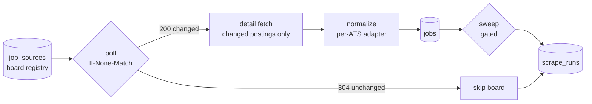
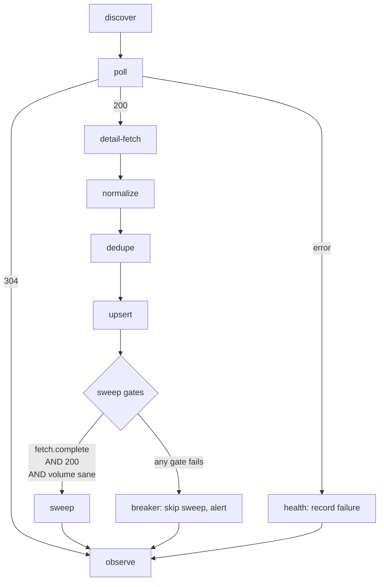
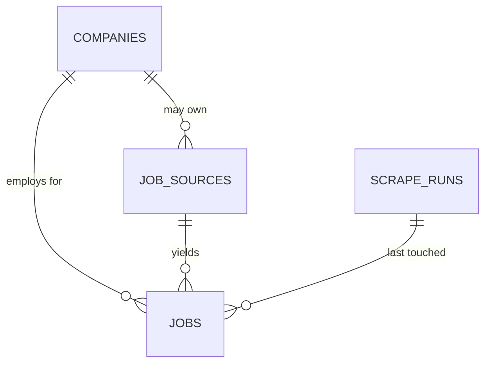

# KAN-55 Job Scraper Architecture

## Scope

Design and build the ingestion engine that fills WorkIt with real job postings:
a registry of employer job boards, one adapter per applicant tracking system
(ATS), normalization into a single job record, and a durable store with an
honest open/closed lifecycle.

This ticket owns the first `jobs` table. `frontend/src/db/schema/index.ts` is
empty by deliberate policy — "the first table lands with the ticket that needs
it" — and [KAN-50](KAN-50_SCHEMA_STRUCTURE.md) explicitly deferred jobs to a
later ticket. This is that ticket.

Two constraints shape every decision below:

1. **Scraped postings are never published to GitHub.** They live in Supabase, or
   in a gitignored local file during development. This is the sharpest break
   from the projects we were pointed at, whose entire product *is* a committed
   file in a public repo.
2. **It has to be better than what already exists.** Section 2 establishes what
   "better" can honestly mean, because most of the well-known projects in this
   space are not doing what their READMEs imply.

### Not in scope

| Excluded | Where it belongs |
| --- | --- |
| Rendering jobs in the UI | A follow-up ticket; the screens currently read fixtures from `data.ts` |
| `match` scoring, resume parsing | The AI/matching epic |
| Employer-authored job creation | Already exists, inert, at `frontend/src/app/company/jobs/new/` |
| Aggregator scraping (LinkedIn, Indeed) | Deliberately rejected — section 2.2 |
| Workday, Oracle, government feeds | Tier 2, after the first four ATSes work |
| Scheduling infrastructure | Section 8 records the constraint; the choice is open |
| **Any markdown output, committed listings file, or Action that publishes postings** | **Nowhere. This is a non-goal, not a deferral.** |

## Intuitive Diagram



Read it as three ideas:

- **A registry, not a hardcoded list.** Adding an employer is a row.
- **Most boards cost nothing on most runs.** A board that has not changed
  answers `304` with an empty body, and the pipeline stops there.
- **Closing a job is the dangerous operation**, so it sits behind a gate rather
  than running unconditionally.

---

## 1. Why ATS-direct

Every posting is read from the employer's **own** applicant tracking system —
the same unauthenticated JSON endpoint their public careers page calls. No
aggregators, no third-party lists, no reselling another repo's data.

| | ATS-direct | Aggregator scraping |
| --- | --- | --- |
| Data shape | structured JSON | parsed HTML |
| Auth | none | none, but bot-walled |
| Blocking | none observed | 429s, proxies effectively required |
| Descriptions | complete | partial |
| Delisting signal | authoritative | inferred, unreliable |
| Legal footing | strongest available | contested |

The decisive evidence is not an opinion about elegance, it is a tombstone.
[JobFunnel](https://github.com/PaulMcInnis/JobFunnel) — 2.2k stars, eight years
old, a genuinely mature aggregator scraper — was **archived in December 2025**
with the note that "most job boards have moved to much more aggressive
anti-automation and bot-detection," and that rebuilding on browser automation
would betray the tool's purpose. Two months before that,
[ats-scrapers](https://github.com/kalil0321/ats-scrapers) was created; it ships
weekly. The field moved. Aggregator scraping is the approach that is dying.

## 2. Prior art

Nine projects were surveyed. Five were downloaded and read as source rather
than from their READMEs, because in three cases the README materially misstates
what the code does.

### 2.1 The two projects we were pointed at

**[SimplifyJobs/Summer2027-Internships](https://github.com/SimplifyJobs/Summer2027-Internships)** (47k ★) — **is not a scraper.**
Its own `CONTRIBUTING.md` describes an "external microservice" that daily copies
rows out of Simplify's private database into `.github/scripts/listings.json`.
The Python in the repo is `main.py readme update` — markdown table generation
with 🔥/🎓/🛂/🇺🇸 badges. Community submissions arrive as GitHub issues labelled
`approved`. There is no ingestion code to learn from, and the half that *is*
there produces exactly the output we are told not to build.

**[speedyapply/2027-SWE-College-Jobs](https://github.com/speedyapply/2027-SWE-College-Jobs)** (9.2k ★) — genuinely scrapes, via
[JobSpy](https://github.com/speedyapply/JobSpy) (4.2k ★, MIT), but against
LinkedIn, Indeed, Glassdoor and ZipRecruiter. JobSpy's own README documents the
cost: aggressive 429 blocking, proxies "usually required" for LinkedIn, a
~1,000-job ceiling per search, and single-parameter search restrictions. Output
is generated markdown.

Neither is a model for what we need. That is the finding, not a slight.

### 2.2 The projects worth learning from

| Project | Scale | What it contributes |
| --- | --- | --- |
| **[zshah101/…Tech-Internships](https://github.com/zshah101/Automated-List-Of-Summer-2027-and-Fall-2026-Tech-Internships)** (732 ★, MIT) | **4,732 boards · 12 ATS · 30-min polling** | 17k lines, its own `ARCHITECTURE.md` and `METHODOLOGY.md`, 266 offline tests. **The closest prior art to this ticket and the best-engineered project in the space.** Most of section 7 is borrowed from it. |
| [Feashliaa/job-board-aggregator](https://github.com/Feashliaa/job-board-aggregator) (143 ★, MIT) | 1M+ jobs · 20k companies · 7 ATS | Company discovery via Common Crawl CDX; a statistical anomaly check with real thresholds. |
| [kalil0321/ats-scrapers](https://github.com/kalil0321/ats-scrapers) (150 ★, MIT) | 70+ ATS | A typed `Job` model, a `BaseScraper` pattern, and **vendored company directories** — the seed list problem, solved. |
| [adgramigna/job-board-scraper](https://github.com/adgramigna/job-board-scraper) (46 ★, MIT) | Scrapy → Postgres → dbt | Per-row run provenance (`run_hash`); a scrape-completeness check in CI. |
| [career-ops-hq/career-ops](https://github.com/career-ops-hq/career-ops) (70k ★, MIT) | 55+ providers | Liveness verification on *new* postings only; ghost-job detection as a first-class concern. |

### 2.3 What zshah101 has not built

Their `ROADMAP.md`, under "Under the hood":

> - [ ] 🟡 **Conditional requests** (ETag / If-Modified-Since) to skip unchanged
>   boards entirely

The best-engineered project in this space wants conditional GET and has not
shipped it. Grepping all five downloaded repositories for `If-None-Match`,
`If-Modified-Since` or 304 handling returns **zero hits**; the only `etag`
reference anywhere is an S3 `put_object(IfMatch=…)` upload in ats-scrapers,
which is unrelated. Section 4 is therefore an unclaimed improvement, not a
misunderstanding of the state of the art.

Also unbuilt on their roadmap: a Next.js site with search and filters, user
accounts, saved jobs, an application-tracking Kanban board, and an AI
resume↔job match score. WorkIt has all of those as built screens and needs the
engine. The complementarity is close to exact, which is the argument for
borrowing their design rather than inventing one.

---

## 3. The sources

### 3.1 Endpoints

All are public, unauthenticated, and are the endpoints each employer's own
careers page already calls.

```
GET  boards-api.greenhouse.io/v1/boards/{token}/jobs
GET  api.lever.co/v0/postings/{slug}?mode=json
GET  api.ashbyhq.com/posting-api/job-board/{name}?includeCompensation=true
GET  api.smartrecruiters.com/v1/companies/{id}/postings?limit=&offset=
POST {tenant}.myworkdayjobs.com/wday/cxs/{tenant}/{site}/jobs     ← tier 2
```

Probed live on 2026-09-09:

| ATS | Board | Result | Payload | Time |
| --- | --- | --- | --- | --- |
| Greenhouse | `stripe` | 200 · 613 jobs | 383 KB | 0.40 s |
| Lever | `ro` | 200 · 47 postings | — | 0.37 s |
| Ashby | `ramp` | 200 · 146 jobs | 2.6 MB | 0.59 s |
| SmartRecruiters | `sierraclub` | 200 · paged | — | — |

### 3.2 The quirk matrix

Every field of consequence is shaped differently by every provider. This table
is the reason normalization is a separate stage from fetching.

| | Greenhouse | Lever | Ashby | SmartRecruiters |
| --- | --- | --- | --- | --- |
| Title field | `title` | **`text`** | `title` | `name` |
| Location | `location.name` | `categories.location` | `location` + `secondaryLocations` | `location` object |
| Date | `first_published`, `updated_at` | `createdAt` (epoch ms) | `publishedAt` | `releasedDate` |
| Descriptions inline | **no** | yes | yes | **no** |
| Structured compensation | no | no | **yes** | no |
| Departments/offices | nested arrays, **detail only** | `categories.team` | `department`, `team` | `department`, `function` |
| Bad tenant returns | `404` | `404` | `404` | **`200`, empty** |

Three consequences worth stating plainly:

**Greenhouse has no compensation field and no work-arrangement field.**
`is_remote` must be inferred from location text. It also serves boards from
three hostnames — `boards.greenhouse.io`, `job-boards.greenhouse.io`, and the
API's `boards-api.greenhouse.io` — so any discovery regex must cover all three
or it will silently miss boards.

**Lever calls the title `text`.** An adapter written by pattern-matching on the
other three will produce rows with empty titles and no error.

**SmartRecruiters cannot distinguish a dead board from a quiet one.** A
nonexistent tenant returns `200 {"totalFound":0,"content":[]}` — identical to a
real company with no current openings. The other three return `404`. Generic
consecutive-failure counting will therefore never flag a dead SmartRecruiters
board, and it will accumulate forever. Health tracking has to be per-ATS. This
is documented nowhere we could find; it was discovered by probing.

---

## 4. Fetch strategy

This section is the one part of this design that no surveyed project
implements, and it is what makes polling 14,600 boards affordable.

### 4.1 Conditional GET

All four feeds emit ETags, and all four honour `If-None-Match`:

```
$ curl -sI boards-api.greenhouse.io/v1/boards/stripe/jobs
etag: W/"d82b4d11251cec79349a5c6e33341d44"
cache-control: max-age=0, private, must-revalidate

$ curl -H 'If-None-Match: W/"d82b…"' …/stripe/jobs
HTTP 304 — 0 bytes
```

| ATS | ETag | Revalidation |
| --- | --- | --- |
| Greenhouse | `W/"d82b…"` | **304, 0 bytes** |
| Lever | `W/"ab1c6-…"` | **304, 0 bytes** |
| Ashby | `W/"job-board:fae3…"` | **304, 0 bytes** |
| SmartRecruiters | present | **304, 0 bytes** |

ETags are content-derived and stable — identical across three calls two seconds
apart — and change when the board changes. Ashby additionally sends
`cache-control: public, max-age=60, stale-while-revalidate=60`.

So `job_sources` stores the last ETag per board, and a run sends it back. An
unchanged board costs one round trip and no body.

**Honest scope.** A high-velocity board like Stripe's 613 postings changes
within hours, so 304s rarely help there. The saving is in the long tail: most of
14,600 boards are small employers whose listings are static for days. The
mechanism converts "polling everything is expensive" into "polling everything is
mostly free", which is what makes a short poll interval — and therefore fast
delisting — practical.

### 4.2 Two-phase detail fetching

Descriptions are large and are not always in the list response. On Greenhouse:

| Request | Size |
| --- | --- |
| `/jobs` | 382,765 B |
| `/jobs?content=true` | 4,733,993 B — **12.4×** |
| `/jobs/{id}` (one posting, with `content`) | 7,580 B |

Refetching every description daily costs 4.7 MB per board. Fetching the cheap
list and then only the postings whose `updated_at` moved costs ~533 KB for
twenty changes out of 613 — roughly a ninth.

**But this is a per-ATS capability, not a universal strategy:**

| ATS | Descriptions in list | Strategy |
| --- | --- | --- |
| Lever | yes — 2,461 chars | single-phase |
| Ashby | yes — 7,341 chars HTML | single-phase (why 146 jobs = 2.6 MB) |
| Greenhouse | no | two-phase via `/jobs/{id}` |
| SmartRecruiters | no — list has `jobAdId`, not `jobAd` | two-phase |
| Workday | no | two-phase |

An adapter therefore declares `descriptions_inline`, and the economics invert
between providers: Ashby's payload is fat and all-or-nothing so a 304 saves the
most there, while Greenhouse's list is cheap and its detail fetches are the
cost.

### 4.3 Politeness

- A `User-Agent` identifying the project and a contact address.
- Per-host **and** per-provider concurrency limits. Every Greenhouse board
  shares one hostname, so a global limit alone still hammers one provider.
- `Retry-After` honoured, capped at 120 s.
- Retries with exponential backoff on transient and rate-limit status codes.
- `robots.txt` respected. It is not legally binding, but honouring it is
  evidence of good faith, and we have no reason not to.

---

## 5. Pipeline



| Stage | What it does |
| --- | --- |
| **discover** | Seed `job_sources` from the vendored CSVs; probe each slug and keep the ones that answer. Common Crawl CDX is the later path past 14.6k. |
| **poll** | Skip quarantined boards. Send `If-None-Match`. A `304` ends this board's work. |
| **detail-fetch** | Only for postings that are new or whose `updated_at` moved, and only for ATSes that need it (§4.2). |
| **normalize** | Per-ATS adapter → one record. Stamped with `normalizer_v`. Every heuristically-parsed field keeps its original string. |
| **dedupe** | Exact natural key `(source_id, external_id)`, with per-ATS overrides where the URL is not unique. |
| **upsert** | Skip the write entirely when `content_hash` is unchanged, so `updated_at` means something. |
| **sweep** | Gated. See §7.2 — this is the dangerous one. |
| **observe** | Write a `scrape_runs` row including which boards were swept and which tripped a gate, so a *skipped* sweep is visible rather than silent. |

---

## 6. Data model



A note on naming, because it is easy to get wrong: zshah101's `companies` table
is `(key, ats, slug, name)` — a **board registry**, not an employer identity.
That maps to our `job_sources`, **not** to KAN-50's `companies`, which is a real
employer account carrying memberships and RLS. WorkIt needs both tables and
conflating them would be a genuine modelling error.

### 6.1 Argument for each piece

| Piece | Why it exists | Signal from prior art |
| --- | --- | --- |
| `job_sources` | Adding an employer becomes a row, not a code change. Holds the ETag and health state that §4 and §7.3 depend on. | Every project at scale has one; zshah101 and Feashliaa both keep it as committed data. |
| `jobs` | The normalized posting, holding both scraped rows and employer-authored ones. | Field set adapted from ats-scrapers' `Job` model, the most battle-tested of those surveyed. |
| `scrape_runs` | Provenance and the evidence base for the anomaly gate. | Levergreen stamps every row with its run; zshah101 mirrors a rich metrics row per run. |
| `companies.claim_status` | Lets a scraped employer exist as a real company row without being mistaken for a customer. | Indeed auto-creates a company page on first posting and has the employer claim it later. Glassdoor and Crunchbase do the same. |

### 6.2 `job_sources`

One row per employer job board to poll.

| Column | Type | Notes |
| --- | --- | --- |
| `id` | `uuid` | Primary key. |
| `ats` | enum | `greenhouse`, `lever`, `ashby`, `smartrecruiters`. |
| `board_token` | `text` | The slug/tenant in the endpoint URL. |
| `company_name` | `text` | Display name from the seed data. |
| `company_id` | `uuid` | Nullable → `companies.id`. Null until matched or claimed. |
| `enabled` | `boolean` | Manual off switch, independent of health. |
| `etag` | `text` | Last seen ETag. The whole of §4.1. |
| `last_polled_at` | `timestamptz` | Including polls that 304'd. |
| `last_success_at` | `timestamptz` | Last `200` with a well-formed body. |
| `consecutive_failures` | `integer` | Feeds the breaker. Interpreted per-ATS (§3.2). |
| `quarantined_until` | `timestamptz` | Set by the breaker; skipped while in the future. |
| `last_job_count` | `integer` | Baseline for the volume gate. |
| `created_at` / `updated_at` | `timestamptz` | |

Constraints: unique `(ats, board_token)`.

### 6.3 `jobs`

| Column group | Columns | Notes |
| --- | --- | --- |
| Identity | `id`, `source_id`, `external_id`, `apply_url`, `requisition_id` | Natural key `(source_id, external_id)`. |
| Origin | `origin` enum `scraped`/`employer`, `company_id`, `company_name` | See below. |
| Content | `title`, `description_html`, `description_text` | |
| Location | `location_raw`, `country_iso`, `is_remote`, `workplace_type` | `location_raw` always preserved — it is free text on three of four ATSes. |
| Compensation | `salary_min`, `salary_max`, `salary_currency`, `salary_period`, `salary_raw` | `salary_raw` preserved for the same reason. |
| Classification | `employment_type`, `department`, `team`, `level` | |
| Timing | `posted_at`, `posted_at_source`, `first_seen_at`, `last_seen_at`, `fetched_at` | |
| Lifecycle | `active`, `closed_at`, `closed_reason`, `missing_streak` | §7.2. |
| Machinery | `content_hash`, `normalizer_v`, `last_run_id`, `raw` | |

### 6.4 `scrape_runs`

`started_at`, `finished_at`, `status`, `boards_total`, `boards_ok`,
`boards_304`, `boards_error`, `fetch_success_rate`, `snapshots_complete`,
`snapshots_partial`, `jobs_new`, `jobs_updated`, `jobs_closed`, `errors`
(jsonb), and per-board `swept` / `breaker_tripped` flags.

`snapshots_complete` and `snapshots_partial` are not decoration. zshah101's
production runs sit at roughly **86% complete snapshots** — about one board in
seven returns something that may have been truncated — and their publish gate
fails the build below 70%. A sweep that ignored this would mis-close jobs
constantly.

### 6.5 Enums

```text
ats_platform:     greenhouse, lever, ashby, smartrecruiters
job_origin:       scraped, employer
employment_type:  full_time, part_time, contract, internship, temporary
workplace_type:   onsite, hybrid, remote
salary_period:    hour, day, week, month, year
posted_at_source: exact, date_only, relative_derived, unknown
closed_reason:    gone_from_feed, out_of_scope, employer_closed
claim_status:     unclaimed, claimed, verified
```

### 6.6 Six columns that need defending

**`origin`** — `jobs` must hold scraped postings *and* the ones employers write
in the composer that already exists at `frontend/src/app/company/jobs/new/`. No
surveyed project has this problem because none of them has an employer side.
Discovering it after the migration ships would be expensive.

**`raw` (capped ~5 kB)** — keep the untouched payload so a normalization bug is
fixed by replaying stored rows instead of re-scraping the internet. None of the
nine projects keeps it. The cap is ats-scrapers' figure and stops one pathological
posting from bloating the table.

**`content_hash`** — skip the write when nothing changed, so `updated_at` means
"the employer edited this" rather than "a cron ran".

**`normalizer_v`** — a stored parse is only trusted while the parser that
produced it is current. Bump the version and stale rows are re-derived, so a
parser fix reaches the whole corpus rather than only rows scraped afterwards.
Borrowed from zshah101's `classifier_v`.

**`posted_at_source`** — records *how well we know* the date, not just the date.
Workday returns `"Posted 3 Days Ago"`; Greenhouse returns a real timestamp. With
a precision ranking `{unknown:0, relative_derived:1, date_only:2, exact:3}` the
store only ever replaces a date with a **higher**-ranked one, so a derived
approximation can be corrected by a detail page but a real date can never
regress to a guess.

**`etag` on the source, not the job** — the unit of caching is the board.

### 6.7 Row-level security

Built on KAN-50's `companies` / `company_memberships`:

- Active jobs are readable by `anon` and `authenticated`.
- Scraped rows are writable only by the service path — never by app code.
- Employer rows are writable by active members of the owning company.
- `job_sources` and `scrape_runs` are service-only: RLS enabled with no policies,
  which is how zshah101 locks their mirror tables.

---

## 7. Correctness and safety

Everything in this section protects one operation: marking a job closed. Getting
it wrong in one direction leaves ghost jobs; getting it wrong in the other
deletes an employer's entire live list. Both failures are worse than a slow run.

### 7.1 The most important function in the pipeline

Borrowed almost verbatim from zshah101's `models.clean_listing`, whose docstring
states the problem better than we could:

> `{"error": "rate limited", "jobs": []}` is an error wearing an empty board's
> clothes, and reading it as "no openings" closes every role the employer has.

So a response body is only accepted as a real listing when it is an object, it
carries **no truthy** error indicator (only truthy — some providers ship
`"error": null` when healthy), the expected key is a list, and every member of
that list is an object. Anything else returns "malformed", **never** an empty
list, and the caller converts that into an incomplete snapshot.

This is the generalized form of the SmartRecruiters trap in §3.2. That was one
provider's quirk; this is the whole class of bug — any `200` whose body does not
actually prove the board was read.

### 7.2 The sweep, and its two guards

A posting absent from an employer's own feed has been taken down. That is a far
stronger signal than an aggregator re-crawling a page, and it is the feature
this whole design exists to deliver: research converges on **20–47% of online
listings not being real**, 81% of recruiters admit their employer posts ghost
jobs, and hiring.cafe — 2.8M listings — is specifically criticised for not
removing postings when they close. Google's job posting guidelines make it a
compliance matter too: expired postings must be removed, and failing to do so
"as soon as they are sure the job is filled" draws a manual action.

So we sweep aggressively — behind two independent guards, because they catch
different failures.

**Guard 1 — the snapshot must be complete.** Every adapter returns
`Fetch{jobs, complete, incomplete_reason}` where `incomplete_reason` is one of
`result-cap`, `malformed-response`, `pagination-stalled`. Several ATSes cap
results (Workday and Oracle at 200 per term, SmartRecruiters at 300), and **a
capped page looks exactly like "no more roles."** A partial snapshot may never
close anything.

**Guard 2 — two consecutive misses.** A first absence sets `missing_streak = 1`
and closes nothing. A second consecutive absence from a complete snapshot sets
`active = false`, `closed_reason = 'gone_from_feed'`. Reappearing disarms the
streak.

The second guard is not redundant. Guard 1 catches *board-level* failure — an
empty, truncated or errored response. It cannot see *job-level* index flicker,
where a response is `200`, fully paginated, count-normal, and still momentarily
omits one posting. Only the streak catches that. zshah101 runs both, at 4,732
boards, and their comment explains the trade exactly:

> "Costs at most one extra run of a genuinely dead role staying listed, in
> exchange for never closing a live one on an index blip."

That cost is **one poll interval**, which is why §8.1 treats the poll interval as
a correctness input rather than a cost knob.

**Guard 3 — the volume gate.** Per-board counts go into a trailing baseline; a
board deviating sharply from it does not get swept, it raises an anomaly.
Feashliaa's implementation uses a 7-day lookback, flags at |z| > 3 standard
deviations, requires ≥5 days of history, and falls back to a 10% band when
variance is zero. We adopt those numbers.

One difference worth stating: in Feashliaa's workflow the anomaly check runs
*after* the merge and after the commit, so it is **observability, not a gate**.
What protects them is that they never close on absence at all — they age rows
out after 30 days. Our design closes on absence, which is far fresher and
therefore *requires* the gate they do not have.

### 7.3 Board health

Dead slugs are guaranteed: a 14,600-row seed list mined from public data will
contain renamed and retired boards. Without a breaker, every dead endpoint costs
retries forever.

Three consecutive failures quarantine a board, with exponential backoff:

| Consecutive failures | Skip for |
| --- | --- |
| 3 | 6 h |
| 4 | 12 h |
| 5 | 24 h |
| 6 | 48 h |
| 7+ | 72 h (cap) |

One success resets the count to zero, so boards that recover — rate-limit
storms, transient bot walls — heal without human intervention. Per §3.2 the
*definition* of failure is per-ATS: a SmartRecruiters board returning
`totalFound: 0` indefinitely needs separate treatment, since it never errors.

### 7.4 Writing to Postgres

Adapted from zshah101's `replace_mirror_snapshot`, which is the most careful
piece of SQL in the survey:

- **One transaction.** Any parse, constraint or upsert failure rolls back
  everything.
- **An advisory transaction lock**, so two overlapping runs settle in order
  instead of deleting each other's rows.
- **Validate into temp tables first** — parse the whole payload, check foreign
  keys and non-blank identities, and only then touch live tables.
- **A staleness guard** — a delayed writer whose fetch timestamp predates the
  current data is rejected outright.

One deliberate divergence: they *delete rows not present in the payload*,
because their JSON store is the source of truth and Postgres is a mirror. **For
WorkIt, Postgres is the source of truth.** We keep the transaction discipline
and the staleness guard, but use incremental upsert plus the gated sweep.

### 7.5 Extraction: deterministic first

Location and compensation are free text on every ATS except Ashby, so something
has to parse them. A published comparison puts advanced regex at 97.0%
extraction / 89.5% quality and an LLM at 98.75% / 91.75% — close enough that a
per-posting model call across a million rows is poor value, while the hybrid
(LLM only where the deterministic path fails) reaches 92% accuracy.

So: deterministic parsing with regex guardrails on dates, numerics and
identifiers; the original string always preserved; provenance recorded via
`posted_at_source`; and an LLM pass reserved for the residue if it proves
necessary. This keeps normalization offline-testable, which matters more than
the last two points of accuracy — zshah101 runs 266 tests with no network.

### 7.6 The standard for heuristics

zshah101's `METHODOLOGY.md` documents a feature they **removed**. They had been
inferring a posting's hiring cycle from its publication month; they audited the
guess against live postings, found it "confirmed **0 times out of 60** and
contradicted every time it was checkable," and deleted it.

Any heuristic added here — remote inference from location text, seniority from
title, salary from prose — carries the same obligation: audit it against real
postings, and delete it if it does not hold.

---

## 8. Operations

### 8.1 Scheduling, and a measured warning

The poll interval is a correctness input, not a cost knob: §7.2's two-strike
rule means a dead posting stays listed for **two poll intervals**.

GitHub Actions is the obvious host and is unreliable at high frequency.
zshah101 measured it and left the finding in a workflow comment:

> "Minutes 7 and 37, not 0 and 30. GitHub queues scheduled workflows globally
> and the top of the hour is the busiest slot — measured Aug 3–5, **only 32 of
> 144 expected runs actually fired, averaging 138 minutes apart.**"

A 30-minute cron therefore delivers roughly 2-hour polling, and ~4-hour worst
case ghost-job latency. Two practical consequences: **never schedule on the hour
or half-hour**, and if latency below a couple of hours matters, the scheduler has
to live somewhere other than GitHub Actions. Conditional GET (§4.1) makes
frequent polling cheap enough that the scheduler, not bandwidth, is the binding
constraint. This remains open — see §10.3.

### 8.2 Concurrency

Per-host and per-provider semaphores, with caps from Feashliaa's production
settings:

| Provider | Concurrent requests |
| --- | --- |
| Workday | 50 |
| Greenhouse, Lever | 30 |
| Ashby | 5 |
| SmartRecruiters | 30 |

Every board is fetched in its own task with its own error handling. One dead
endpoint never breaks a run, and — critically — postings are only closed for
boards that fetched successfully.

### 8.3 Observability

- A `scrape_runs` row per run; `jobs.last_run_id` puts provenance on the row.
- Per-board anomaly detection (§7.2) with an explicit record when a sweep was
  **skipped**, so a suppressed sweep is never silent.
- Publish-gate style thresholds, borrowed from zshah101's `verify_accuracy.py`,
  which are set well below observed healthy numbers so ordinary variance does
  not trip them:

| Gate | Threshold | Their observed |
| --- | --- | --- |
| Complete-snapshot rate | ≥ 0.70 | ~86% |
| Degraded-fetch rate | ≤ 0.05 | ~1.2% |
| Non-quarantined registry rate | ≥ 0.80 | — |

### 8.4 Local development

`--dry-run` writes normalized JSONL to a gitignored `backend/.scraped/` and
touches no database, so the whole pipeline runs end-to-end with no Supabase
credentials. That is what "keep it local" means in practice, and it is also how
`git ls-files | grep scraped` stays empty.

### 8.5 Legal position

`hiQ v. LinkedIn` and `Van Buren` establish that scraping public data does not
violate the CFAA; a terms-of-service breach is a contract matter, not a crime.
ATS endpoints are the strongest available case — no authentication gate, no
credentials, no circumvention, and they are the same endpoints the employer's
own careers page calls. Not republishing the corpus removes the redistribution
question entirely.

---

## 9. Attribution and licensing

Every project this design borrows from is MIT licensed. MIT permits commercial
use and modification and **requires the copyright notice and licence text to
travel with derived work**.

| Upstream | Copyright | Borrowed |
| --- | --- | --- |
| [zshah101/…Tech-Internships](https://github.com/zshah101/Automated-List-Of-Summer-2027-and-Fall-2026-Tech-Internships) | © 2026 Shah Zain | `clean_listing` semantics, the `Fetch` completeness contract, date-precision ranking, the streak sweep, health backoff, upsert transaction discipline |
| [kalil0321/ats-scrapers](https://github.com/kalil0321/ats-scrapers) | © 2026 Kalil Bouzigues | The company directory CSVs; `Job` model field set |
| [Feashliaa/job-board-aggregator](https://github.com/Feashliaa/job-board-aggregator) | © 2026 Riley Dorrington | Anomaly-detection thresholds; per-provider concurrency caps |
| [adgramigna/job-board-scraper](https://github.com/adgramigna/job-board-scraper) | © 2023 Andrew Gramigna | Per-row run provenance |

`backend/workit_scraper/THIRD_PARTY.md` carries the full notices, and the
vendored CSV directory carries ats-scrapers' licence alongside the data.

---

## 10. Boundary, order, and open questions

### 10.1 What this ticket hands the next ones

| Consumer | Gets |
| --- | --- |
| Job board UI | `jobs` with `active = true`, publicly readable |
| Matching epic | `description_text` and structured fields to score against |
| Company profiles | `companies` rows for scraped employers, marked `unclaimed` |
| Admin/audit | `scrape_runs`, and per-board health |

### 10.2 Implementation order

1. `backend/` skeleton — packaging, lint, type-check, CI hook.
2. `net.py`: async HTTP, per-host limits, retry/backoff, `Retry-After`.
3. `models.py`: the `Job` record, `Fetch`, `clean_listing`, date precision.
4. The Greenhouse adapter, plus offline tests against captured fixtures.
5. Lever, Ashby, SmartRecruiters — the quirk matrix in §3.2 is the test plan.
6. Drizzle schema + migration for the three tables and `claim_status`.
7. `store.py`: upsert, content hashing, the gated sweep.
8. `health.py`: the breaker.
9. Seed `job_sources` from the vendored CSVs; probe and prune.
10. Run metrics, anomaly detection, and the publish gates.

Steps 1–5 are independently useful and testable with no database, which is why
the schema lands in the middle rather than first.

### 10.3 Open questions

**Poll interval and host.** Accept ~2–4 h ghost-job latency on GitHub Actions,
or run the scheduler on Supabase cron or a small VM? §8.1 is the evidence; the
call is a product one about how fresh "fresh" has to be.

**Claim verification depth.** Email-domain match against
`companies.website_url` is Indeed's model and the lowest friction; DNS TXT is
authoritative but demands DNS access. Which grants `claimed` and which grants
`verified`, and does an unverified claim allow writes or only a review queue?
This is arguably KAN-22/KAN-50 territory.

**First-run breadth.** Resolved in principle — poll every board and filter in
config, rather than trimming the registry — but the filter's initial values
(role scope, region, max age, per-company cap) still need choosing.

**Cross-source duplicates.** Deferred, deliberately. Textkernel reports 50–80%
duplicate rates industry-wide and says a similarity threshold alone is
insufficient; JobFunnel left inter-scrape dedupe as an unresolved `FIXME`
through to archival. ATS-direct sourcing avoids most of it by construction. When
it is needed, Lightcast's documented method is the path: exact source-level keys
first, then normalized `title` + `company` + `location` compared across a
rolling 60-day window.

---

## Appendix: reproducing the measurements

Every number in §3 and §4 came from a direct request and can be re-checked:

```sh
# Board size, and the 12.4x description cost
curl -s -o /dev/null -w '%{size_download}\n' \
  'https://boards-api.greenhouse.io/v1/boards/stripe/jobs'
curl -s -o /dev/null -w '%{size_download}\n' \
  'https://boards-api.greenhouse.io/v1/boards/stripe/jobs?content=true'

# Conditional GET: expect "304 0"
ET=$(curl -sI 'https://boards-api.greenhouse.io/v1/boards/stripe/jobs' \
     | awk -F': ' 'tolower($1)=="etag"{print $2}' | tr -d '\r')
curl -s -o /dev/null -w '%{http_code} %{size_download}\n' \
     -H "If-None-Match: $ET" 'https://boards-api.greenhouse.io/v1/boards/stripe/jobs'

# Error semantics: 404, 404, 404, then 200 with an empty result
for u in \
  'https://boards-api.greenhouse.io/v1/boards/zzznotreal123/jobs' \
  'https://api.lever.co/v0/postings/zzznotreal123?mode=json' \
  'https://api.ashbyhq.com/posting-api/job-board/zzznotreal123' \
  'https://api.smartrecruiters.com/v1/companies/zzznotreal123/postings?limit=1'
do curl -s -o /dev/null -w "%{http_code} $u\n" "$u"; done
```
